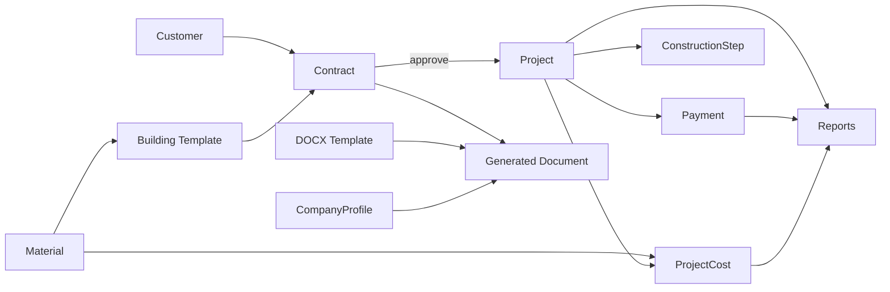

# Contractor Plus — Comprehensive Software Audit & Product Improvement Report

> Prepared as a professional product review. Findings are grounded in the actual source (evidence cited as `file:line`). The tone is deliberately blunt per request — strengths are credited, but the focus is on what to fix and why.
>
> **Reviewed build:** `v0.1.0` · monorepo (`backend/`, `frontend/`, `packages/shared/`) · 148 backend `.ts` files, 137 Vue files, ~89 API endpoints, 15 RBAC modules.
> **One-line characterization:** An unusually well-engineered Arabic/RTL Windows desktop app for construction-contractor management, with a sophisticated service/self-heal lifecycle — undercut by a public-tunnel-without-throttling security hole, zero business-logic tests, an unsigned installer, no backup, and float-based money math.

---

# 1. Executive Summary

**Main purpose.** A desktop business-management system for construction contractors: manage customers, build reusable cost/step *building templates*, turn them into *contracts*, convert approved contracts into *projects*, track *construction steps / progress*, log *costs* and *payments*, watch *cash flow / profitability / overdue / delays* in reports, and generate *contract DOCX* documents from templates — all in Arabic, right-to-left.

**Target users.** Small-to-mid construction/contracting firms in Arabic-speaking markets (the seeded default currency is IQD; UI is Arabic-only). Roles imply a small team: an OWNER/ADMIN, an ACCOUNTANT (finance), an ENGINEER (operations), and read-only VIEWERs.

**Core business value.** Replaces spreadsheets + manual Word contracts with a single role-aware system that ties money (contract value → costs → payments → profit) to physical progress (projects → construction steps), and auto-generates client-facing contract documents. The optional Cloudflare tunnel lets the owner reach the office machine remotely.

**Overall architecture quality — Strong (7.5/10).** Genuinely above-average for a line-of-business desktop app. The backend has real, uniformly-applied controller→service→repository layering; config/secrets handling is exemplary; the Electron desktop lifecycle (two-phase boot, self-healing Windows Service, version-compat gate, fail-fast migrate-on-boot) is sophisticated. The frontend is type-safe and consistent.

**Overall UI/UX quality — Good but unfinished (6.5/10).** A real design-token system with a complete dark theme, polished setup wizard, first-class empty/error states, and correct RTL. But there are **no charts anywhere** in a numbers-heavy product, the **Arabic brand font is declared but never loaded**, the "shared" table primitives are **placeholder stubs**, and accessibility has systemic gaps.

**Scalability — Moderate-to-weak (5/10).** Reports avoid N+1 well, but it's a single-process server that does **synchronous DOCX rendering on the event loop**, has **no caching layer** (frontend refetches every navigation), no connection-pool tuning, and no rate limiting. Fine for one user on a LAN; strained the moment the tunnel invites concurrent remote use.

**Maintainability — Good, with one glaring risk (6.5/10).** Code is navigable, consistent, and strongly typed (zero `any` across 137 Vue files). The risk is **near-zero automated tests**: 4 manual smoke files, no test runner declared, nothing covering money math or state machines.

**Overall score: 6.0 / 10.** A strong, thoughtfully-built foundation that is **not yet production-ready** for the financial, multi-user, internet-exposed posture it already enables. Close the security, testing, backup, and code-signing gaps and this is comfortably an 8.

### Consolidated scorecard

| Dimension | Score | Headline |
|---|:---:|---|
| Architecture | 7.5 | Real layering, great config, sophisticated desktop lifecycle |
| UI (visual) | 7.0 | Polished tokens + dark mode; no charts, no brand font loaded |
| User Experience | 6.5 | Good flows & states; no search/shortcuts/bulk, a11y gaps |
| Performance | 5.5 | Good report queries; sync DOCX + no caching + full MDI font |
| Scalability | 5.0 | Single process, no cache/pool/rate-limit |
| Security | 4.5 | Strong RBAC & uploads; **public tunnel + no throttling**, localStorage refresh token, plaintext secrets |
| Innovation | 6.0 | Self-heal service & tunnel are clever; no AI/modern intelligence |
| Developer Experience | 6.5 | Excellent types & patterns; heavy boilerplate, no tests, lint gaps |
| Maintainability | 6.5 | Consistent & typed; testing void is the liability |
| **Overall** | **6.0** | Strong foundation, real gaps before "production-grade" |

---

# 2. Application Overview

## What it does
Contractor Plus runs the full contractor money-and-progress lifecycle on one Windows machine. A Vue SPA (the UI) talks to a Fastify/Prisma/PostgreSQL backend that runs **as a Windows Service** and serves *both* the API and the SPA from a single origin (`http://127.0.0.1:31734` in production). Electron is the desktop shell that boots, installs/heals the service, and renders the SPA.

## How users interact with it
A single desktop window. First run is a **5-step setup wizard** (no backend yet); thereafter it's a normal sidebar-navigated SPA. Optional remote access is achieved by enabling a **Cloudflare tunnel** that publishes the local service to a public hostname.

## Complete workflow (end to end)

```
Install (NSIS) ─▶ Setup Wizard ─▶ Login ─▶ Daily Operations ─▶ Reporting/Docs
   │                  │              │            │
   │   ┌──────────────┴───────────┐  │   ┌────────┴───────────────────────────┐
   │   1 Welcome                   │  │   Customer ─▶ Building Template          │
   │   2 Database (test conn)      │  │       └─▶ Contract (DRAFT→APPROVED)      │
   │   3 First user (PIN)          │  │             └─▶ Project (PLANNED→…→DONE) │
   │   4 Initialize (migrate+      │  │                   ├─ Construction Steps  │
   │     bootstrap, elevated)      │  │                   ├─ Costs (5 categories)│
   │   5 Success (show PIN once)   │  │                   └─ Payments (mark paid)│
   └───────────────────────────────┘  │   Reports (P&L, cash flow, overdue,     │
                                       │   delays)  ·  Generate Contract DOCX     │
                                       └──────────────────────────────────────────┘
```

## User journey & friction points
1. **Install** → SmartScreen warning (unsigned) → "Run anyway".
2. **Setup** → must already have a running PostgreSQL and know admin credentials (**a heavy prerequisite for a non-technical contractor**); ~8 interactions on the DB step; finalize triggers a UAC prompt to write ACL-locked `service.json` and install the service.
3. **Daily use** → Customer → Template → Contract → approve → Project → costs/payments → reports → DOCX. Friction: **no global search**, reports reload cold each visit, **DOCX can't render line items**, payments are marked paid one-at-a-time.

## Main modules & relationships
- **Identity:** Auth (JWT + refresh), Users, RBAC (Roles/Permissions).
- **Commercial core:** Customers → Contracts → Projects, scaffolded by Building Templates + Materials.
- **Financials:** Costs and Payments hang off Projects; Reports aggregate across all of them.
- **Documents:** DOCX Templates + Generation pipeline, pulling from Contracts/Projects/Customers/Company Profile.
- **Platform:** Settings (currency, company profile, appearance), Audit Logs, Tunnel (remote access), Uploads (logo/stamp).



## Business logic highlights
- **Money:** contract `totalPrice = buildingArea × floors × meterPrice`; profit = contract value − costs; collection % = paid ÷ total. (Stored as SQL `Decimal`, but computed in JS floats — see §8/§9.)
- **State machines:** Contract `DRAFT→APPROVED→CANCELLED`; Project `PLANNED→IN_PROGRESS⇄PAUSED→COMPLETED/CANCELLED`; Payment `PENDING→PAID/CANCELLED`. Status changes only via explicit action endpoints, never via PATCH (`projects.routes.ts:32-42`) — a clean, deliberate design.
- **Templates** store quantities per baseline area and **auto-scale** linearly to the contract's area when generating an estimate.

---

# 3. Technologies Used

## Frontend
| Concern | Choice | Verdict |
|---|---|---|
| Framework | **Vue 3.5** (Composition API) | Excellent fit; modern, reactive, great DX. Keep. |
| UI library | **Vuetify 3.7** (Material Design) | Reasonable; gives accessible components & RTL for free. Heavy, but tree-shaken (`vite-plugin-vuetify autoImport`). Keep, but see icons. |
| Layout utilities | **TailwindCSS 3.4** (`preflight:false`) + `tailwindcss-rtl` | Used layout-only; **correct** way to combine with Vuetify, minimal overlap. Keep. |
| Icons | **@mdi/font** (full webfont) | **Replace** with `@mdi/js` SVG — full ~1.2k-glyph font ships for ~60 icons (`vuetify.ts:2`). |
| State | **Pinia** | Right choice; stores are small & scoped. But **no server-state cache** (see §7). |
| Routing | **Vue Router 4** | Excellent — all routes lazy-loaded, layered guards. Keep. |
| HTTP | **Axios** + custom interceptors | Strong client (`client.ts`); textbook 401-refresh dedup. Keep, but consider vue-query on top. |
| Validation | **Hand-rolled Vuetify rules** | **Weak** — duplicated across 15 forms, not shared with backend Zod (see §8). |
| Charts | **None** | **Critical gap** — no chart library at all. |
| Styling tokens | Bespoke `--cp-*` CSS variables + dark theme | Good craft, but duplicates the Vuetify palette (3 sources of truth). |
| i18n | Custom 35-line `t()` over single `ar.json` | Pragmatic for Arabic-only; **non-reactive**, a one-way door if English is ever needed. |

## Backend
| Concern | Choice | Verdict |
|---|---|---|
| Framework | **Fastify 4** | Excellent — fast, plugin model suits the layering. Keep. |
| ORM | **Prisma 5.22** | Strong; type-safe, good migration story. Keep. |
| Database | **PostgreSQL** | Powerful and correct for relational financial data — but a **heavy dependency for a single-machine desktop app** (setup must provision it). A bundled embedded DB would lower onboarding friction. |
| AuthN | **JWT (HS256) + opaque refresh tokens** (bcryptjs hashing) | Good design (server-side refresh table, rotation, revocation). Weaknesses: alg not pinned, numeric-PIN credential. |
| AuthZ | **Hybrid RBAC** (Permission + Role + RolePermission) | Excellent modeling; consistently enforced. |
| Validation | **Zod** | Strong on input; **absent on output** (DB shape leaks to wire). |
| Logging | **pino** | Structured & non-leaky; but prod level is `warn` (no request log). |
| Docs | **docxtemplater + pizzip** | Works; **synchronous** (blocks event loop) and only 17 placeholders, no table loops. |
| File storage | Local disk under storage root, UUID-named, public/private split | Genuinely well done. |

## Desktop
**Electron 31.7.7** + **electron-builder 25** + **electron-updater** (GitHub Releases feed) + **WinSW** (Windows Service wrapper) + bundled **node.exe** + bundled **cloudflared.exe**. Two-phase window (app:// wizard / service-served app). `contextIsolation:true`, `nodeIntegration:false`, minimal preload bridge. **Unsigned** (a distribution problem).

## Infrastructure / Build / Tooling
- **Build:** deterministic `build-backend.js` bundle (compiled backend + prod deps + Prisma engine + node.exe + WinSW + cloudflared), `afterPack.cjs` asserts the service descriptor is secret-free, NSIS installer, `verify:packaged` post-check, SHA-256 supply-chain checks on fetched binaries.
- **Package mgmt:** **pnpm 9** workspace. Correct, modern.
- **Quality:** ESLint 9 (flat config, `--max-warnings=0`), Prettier, per-package `tsc`. **But `frontend/electron/**` is excluded from lint** (`eslint.config.js:19`) — the most failure-prone code gets no static analysis.
- **Testing:** *effectively none* (4 manual `node --test` smoke files; no runner; no `"test"` script).
- **Architecture pattern:** Layered/modular monolith (backend), feature-folder MVVM-ish (frontend), with a shared types/enums/contracts package — a clean, pragmatic choice.

**Net technology verdict:** The stack is modern and well-chosen. The two choices worth revisiting are **PostgreSQL-as-prerequisite** (onboarding friction) and the **full MDI webfont** (bloat). Everything else is appropriate; the problems are in *what's missing* (tests, charts, signing), not *what was picked*.

---

# 4. Current Features

> **Note on scope:** the request's template lists retail concepts — *Products, Inventory, Sales, Returns, Online Orders, Shipping, POS*. **None of these exist, and none should** — this is a contractor/project system, not a store. The genuine domain analogues are below. Naming the mismatch is part of the honest read: don't bolt retail features onto a contractor product.

The canonical feature surface is the permission catalog (`rbac.catalog.ts`): **15 modules, 60 permission keys, 5 system roles**.

### Authentication & Sessions
- **Purpose:** username + numeric PIN → JWT access + rotating refresh token; logout / logout-all; constant-time-ish failure.
- **Limitation:** PIN-only (weak credential space), **no lockout/rate-limit**, no MFA/SSO, password reset has no email delivery.

### Users
- **Purpose:** CRUD, activate/deactivate (invalidates refresh tokens), reset-password (temp + force change).
- **Limitation:** temp credentials handed over manually (no email); a sub-OWNER with `users.*` can assign ADMIN (privilege-escalation, §9).

### Roles & Permissions (RBAC)
- **Purpose:** 60 permission keys, custom roles, atomic permission-set replacement, permission-matrix UI; OWNER is immutable super-admin.
- **Limitation:** mid-migration "hybrid" state — routes still carry both `permissions` and legacy `roles` (dual source of truth); no matrix export.

### Customers · Materials · Building Templates
- **Customers:** minimal CRM (name/phone/email/address/notes), search, soft-delete. *Missing:* contacts, interaction history.
- **Materials:** shared cost catalog (name/unit/default price). *Missing:* suppliers, price lists, **stock/inventory tracking** (intentionally — not an inventory app).
- **Building Templates:** reusable line-items + construction steps; quantities auto-scale to area. *Limitation:* flat linear scaling, hardcoded baseline.

### Contracts
- **Purpose:** CRUD + line items; `totalPrice` computed; `DRAFT→APPROVED→CANCELLED`; approve creates a Project; estimate generation from a template; DOCX generation.
- **Limitation:** financials lock after APPROVED; **no amendment/revision flow**; cancel blocked once a project exists.

### Projects & Construction Steps
- **Purpose:** lifecycle state machine, manual progress %, construction-step milestones, live per-project financial summary, delayed-project detection.
- **Limitation:** progress is **manual entry** — no Gantt, dependencies, scheduling, or critical path; delay detection only surfaces when a report is opened (no background job).

### Costs · Payments
- **Costs:** project-linked, 5 categories, date/category filters, rollups. *Missing:* PO/approval workflow, receipt attachments.
- **Payments:** `PENDING→PAID/CANCELLED`, mark-paid, overdue (LATE) derived at read-time. *Missing:* stored overdue state, reminders/escalation, bulk mark-paid.

### Reports & Analytics
- **Exactly 6 endpoints:** Dashboard KPIs, Project Profitability, Cash Flow, Overdue Payments, Delayed Projects (+ the dashboard rollup).
- **Limitation:** **screen-only — no PDF/Excel/CSV export**, **no charts**, no scheduled/emailed reports, no custom report builder.

### Document Templates & DOCX Generation
- **Purpose:** upload `.docx`, placeholder extraction, docxtemplater merge, structured error codes, generated docs persisted & linked.
- **Limitation:** **only 17 placeholders, no line-item/table loop** — itemized contracts can't be fully rendered; project "location" falls back to customer address.

### Company Profile · Currencies · Settings · Appearance
- **Company profile:** singleton with logo/stamp upload. *Missing:* multi-company/branch.
- **Multi-currency:** add/edit, symbol position, precision, set-default atomically. *Limitation:* manual exchange rates, display-only (not historical-rate-aware).
- **Appearance:** **Dark mode present** (Light/Dark/System, persisted, reactive). Good.

### Audit Logs
- **Purpose:** immutable trail (CRUD + transitions), old/new values, actor, IP, UA; entity & user history views.
- **Limitation:** OWNER/ADMIN-only; **no export, no retention/pruning**; diffs hand-built per call site (easy to forget on new mutations).

### Remote Access / Tunnel
- **Purpose:** enable/disable/status Cloudflare tunnel; auto-resume on boot; diagnostics/QR.
- **Limitation:** **no identity layer in front** — once on, the whole API is public (see §9).

### Desktop / Service / Setup / Auto-update
- **Purpose:** install/start/stop/restart/repair the Windows Service; self-heal on boot; version-compat gate; migrate-on-boot; 5-step setup wizard; electron-updater.
- **Limitation:** **unsigned**; manual bad-release handling; UAC-decline aborts with no fallback.

### Explicitly ABSENT (named so they're not assumed)
**Backup/Restore · Data Import/Export · Notification center · Email/SMS · Global search · Dashboard customization · Multi-language · Invoicing/accounting export · Native mobile.** The most damaging of these for a *financial* system is the **total absence of backup/restore**.

---

# 5. UI/UX Review

*Verified against source; rendered-look judgments flagged [inferred].*

## Visual design verdict
A **better-than-average Vuetify app with a real designer's hand.** The `--cp-*` token system (`main.css`) is coherent — slate/blue palette, a tuned 4-step shadow ramp, radius scale, motion tokens, and a **complete dark theme** that re-skins even the non-Vuetify chrome (`main.css:51`). The frosted topbar, accent-rail sidebar, and gradient brand mark show genuine craft. The setup wizard and login look like shipped product.

> ### 🔴 The single biggest visual weakness: no data visualization, and no Arabic brand font.
> 1. **Zero charts** anywhere — no chart lib, no `<canvas>`, no `<v-sparkline>`. Every "visualization" is a number in a card or a table row. `CashFlowReportView` has date-range filters and renders **five number tiles** where a line/area chart belongs. For a money product, this is the highest-leverage gap.
> 2. **No Arabic webfont is loaded.** `tailwind.config.js:10` declares `"IBM Plex Sans Arabic"`, but there is no `@font-face` and no `<link>` in `index.html` — it silently falls back to system Segoe UI. [inferred: text renders generic, with no brand voice.]

## Information architecture & navigation — Strong
Sidebar groups 16 destinations into Operations / Directory / Finance / System, each **RBAC-gated** with empty groups auto-collapsing (`SideNav.vue:37-81`). Nothing is more than one click from the sidebar. **Gaps:** no breadcrumbs (deep edit screens rely on a lone icon-only back arrow), **no global search / command palette**. RTL navigation (arrow directions) is correct.

## Component-by-component findings

| Component / Screen | Issue | Sev | Why it matters | Better solution |
|---|---|:---:|---|---|
| Reports + Dashboard | **No charts/sparklines at all** | **Crit** | Trends & comparisons are the contractor's core questions | Add ApexCharts/Chart.js: monthly P&L line, cash-flow area, overdue-aging bar, progress bars |
| Typography (global) | Arabic font declared but never loaded → Segoe UI | **High** | Arabic-only product reads generic | Self-host IBM Plex Sans Arabic via `@font-face` + `font-display:swap` |
| `shared/DataTable.vue` | Literal `"DataTable placeholder"` (`:8`); every list hand-rolls `v-data-table-server` | **High** | The table abstraction the architecture implies **doesn't exist**; ~12 views duplicate ~45 lines each | Build the real wrapper + `usePaginatedList`, migrate lists onto it |
| `FilterBar.vue` / `Pagination.vue` | Placeholder shells | **Med** | Filters/pagination re-implemented per screen; blocks saved-filters | Flesh out; centralize |
| `shared/StatusBadge.vue` | Ignores its `kind` prop; imported nowhere (dead); real badges live in feature folders | **Med** | Misleading "shared" primitive; inconsistency risk | Delete or make canonical |
| List rows | Row-click nav is **mouse-only** (`@click:row`) | **High** | Keyboard/AT users can't open a record at all | Make name cell a real link or `tabindex`+Enter |
| Per-project Costs/Payments tabs | Raw `<v-table>`, **no pagination/sort** | **Med** | 100+ rows render & scroll entirely | Use the server table |
| Toasts | N snackbars all pinned `top end`, no stack cap (`App.vue:27-43`) | **High** | Fire 3-4 actions → toasts **overlap** and are unreadable | Single managed queue / stacked container, max 3, as a live region |
| Forms | Validation returns `' '` (a space) as the error message; on-submit only | **Med** | Field turns red with **no text explaining why**; high load on 12-field dialogs | Real messages + on-blur validation; mark required fields |
| DOCX generate panel | Solid, but **no preview** before generating | **Low** | User can't verify before producing a client doc | Add first-page preview / confirm summary |
| `ConfirmDialog` | Good; but no autofocus, `persistent` blocks Esc | **Low** | Slower keyboard flow | Autofocus safe action, allow Esc on non-destructive |
| `LoadingOverlay` | No `role="status"`/`aria-busy` | **Med** | Loading is silent to AT | Add live-region status |
| `EmptyState`/`ErrorState` | **Genuinely good & reused** (retry, reqId surfaced) | ✅ | — | Also wire into table `#no-data` slots |
| Loading (global) | **Per-widget skeletons**, not full-page spinners | ✅ | Strong perceived performance | — |
| `MoneyDisplay`/`DateDisplay` | tabular-nums, locale-aware, null→`—` | ✅ | Exactly right for finance | — |

## Accessibility findings
- **[High]** Icon-only buttons have **no `aria-label`** — systemic (~13 back buttons + table actions; grep found ~8 labels in the whole frontend). The TopBar sidebar-toggle is even mislabeled `t('common.language')` (`TopBar.vue:30`).
- **[High]** List rows openable by mouse only — no keyboard path.
- **[Med-High]** Toasts overlap and aren't a managed live region.
- **[Med]** No `role="status"`/`aria-busy` on loading; empty `' '` validation strings defeat `aria-describedby`.
- **[Low-Med]** `--cp-text-subtle #94a3b8` on light surface ≈ 2.9:1 [inferred] — fails WCAG AA for small text.
- **[Good]** RTL is implemented correctly (root `dir="rtl"`, Vuetify `rtl:{ar:true}`, logical properties, correct arrow directions).

## Severity summary
1 Critical (no charts), several High (font, dead primitives, keyboard access, toasts, icon labels). The visual *foundation* is strong; the *feature layer* on top of it is half-finished.

---

# 6. Ease of Use Analysis

**New-user difficulty: Medium-High at onboarding, Low afterward.** The wall is the **setup wizard's database step** — it assumes a running PostgreSQL and admin credentials, plus a UAC elevation. For a non-technical contractor that's a real barrier (and the single strongest argument for bundling an embedded/managed DB). After setup, the RBAC-scoped sidebar makes daily navigation easy.

**Clicks for common tasks**
- *New project:* 1 nav click + form (Quick Actions panel exposes it directly — `QuickActionsPanel.vue:28`). **Good.**
- *Contract → DOCX:* ~3-4 clicks, auto-downloads. **Reasonable.**
- *Add payment:* open project → (tabs gated until first save) → Payments tab → Add → 5-field dialog → Create ≈ 3 clicks + modal. The save-gate adds a round-trip before money can be recorded.

**Which workflows can be simplified**
- **Marking many payments paid** is one-at-a-time → add **bulk mark-paid**.
- **Finding anything** requires going to its section and filtering → add **global search (Ctrl+K)**.
- **Re-applying report filters** every visit → add **saved filters / remembered state**.

**Confusing / overloaded screens**
- **`ProjectEditView`** is the heaviest (back-bar + action toolbar + read-only header card + progress card + 4-tab card + sticky 8-metric sidebar). The tab count (4) is acceptable; the real waste is the **read-only header card duplicating** data already in the sidebar and tabs — trim it.
- **AddCost dialog = 12 fields** in a modal — convert to a slide-over or grouped sections.

**Unnecessary / weak elements**
- Dead "shared" primitives (`DataTable`/`FilterBar`/`Pagination`/`StatusBadge`) masquerade as infrastructure — delete or build them.
- The "language" setting is vestigial (Arabic-only).

**Missing power-user features (all confirmed absent):** command palette, keyboard shortcuts (no Ctrl+S), bulk actions/multi-select, saved filters, inline editing, breadcrumbs. For an app users sit in all day, this is the difference between "usable" and "fast."

---

# Workflow Optimization & User Productivity Analysis

> **Scope:** pure UX & productivity — fewer clicks, less navigation, more automation. Architecture/code quality is deliberately *out of scope* in this section. Every current click-count was traced against the real interaction code (cited `file:line`), not guessed.
>
> **The central finding:** the daily loop is *functional but click-heavy*. Three habits inflate every task: (1) **modal dialogs + confirmation dialogs** for routine actions, (2) **full-page navigation** for create/edit instead of in-context panels, and (3) **no global search, no bulk, no keyboard path, no "save & add another".** The good news — the team already understands smart defaults (today-dates, material auto-fill, pre-filled project names), so the fixes are extensions of patterns they've already proven, not new philosophy. Target: cut the clicks for the 8 highest-frequency tasks by **40–70%**.

## 1. Workflow Analysis

Clicks = discrete pointer/keyboard actions (button, tab, row, menu, dialog-confirm). Field typing isn't counted, but field-count is noted in the per-row notes. "Current" reflects an experienced user on the happy path.

| Operation | Current steps | Proposed steps | Clicks now | After | Improvement |
|---|---|---|:--:|:--:|:--:|
| **Login** | type user → type PIN → click Submit | autofocus user, Enter submits, remember last username, numeric PIN pad | 3 | 2 | ~33% |
| **Create customer** | Sidebar→Customers → New (page nav) → 5 fields → Save → returns to list | "+ New" opens a **slide-over** on the list (no nav) → Ctrl+S → "Save & add another" | 3 + full nav | 1 + save | ~50% |
| **Create material** | Sidebar→Materials → New (page) → fields → Save | inline slide-over **+ create-material-on-the-fly from the cost dialog** | 3 + nav | 1 | ~60% |
| **Add cost to project** | open project → Costs tab → Add Cost → 9-field modal → Create | **inline row-add** in the costs table + remember last category/date + "Save & add another" | 3 + modal | 1–2 | ~55% |
| **Add payment** | open project → Payments tab → Add → 5-field modal → Create | inline add + **"already paid" toggle** (skips the separate mark-paid) | 3 + modal | 1–2 | ~50% |
| **Mark payment paid** | Payments tab → row Mark-Paid → modal (date) → Confirm | **one-click "Mark paid (today)"** with Undo; bulk-select for many | 2 + modal | 1 | ~60% |
| **Approve contract** | open contract → Approve → dialog (date) → Confirm | inline Approve (date defaults) + Undo; or "Approve & create project" combined | 2 + dialog | 1 | ~50% |
| **Contract → Project** | Approve (2) → Create Project btn → dialog → Create → navigates | **"Approve & start project"** single action (fields already pre-filled) | 4 (2 dialogs) | 2 | ~50% |
| **Start / resume / pause project** | button → **confirm dialog** → Confirm | direct action + **Undo toast** (drop confirm for non-destructive) | 2 | 1 | ~50% |
| **Generate contract DOCX** | open contract → scroll to panel → (template default) → Generate → auto-download | add **"Generate DOCX" from the contract row/list** + preview | ~1 (good) | 1 | already lean |
| **Find a specific record** | Sidebar→section → type in that section's search → open | **Ctrl+K global search** from anywhere → type → Enter | 2 + nav | 1 | ~60% |
| **Edit a record** | list → row click (nav to page) → edit → Save → back | **inline edit** for simple fields; side-panel for full edit | 3 + nav | 1–2 | ~45% |
| **Delete a record** | list → row delete → confirm dialog | keep confirm (destructive) **but add bulk-delete + Undo** | 2 | 2 (1 for many) | bulk only |
| **View a report** | Sidebar→Reports → pick report → loads cold | report **cards on the dashboard** + remembered date range + cached | 2 + nav | 0–1 | ~60% |
| **Create building template** | Templates → New → general/materials/steps tabs → many rows | **"Duplicate from existing"** + inline row quick-add | 5+ | 2–3 | ~50% |
| **Change settings (e.g. currency)** | Sidebar→Settings → tab → dialog → save | direct deep-links + inline edit | 3 + dialog | 2 | ~35% |

**Per-operation notes (why each is slow today):**
- **Add cost** (`AddCostDialog.vue`) is the highest-volume entry task and the biggest single win: it's a **9-field modal** (`:215-314`) reached only after a tab switch, with **no "add another"** — so logging 10 site costs = 10 × (Add → fill → Create) round-trips. Inline row-add + sticky last-used category/date would roughly halve the time.
- **Payments take two operations to represent reality.** You create a `PENDING` payment (`AddPaymentDialog.vue`), then *later* open `MarkPaidDialog` (`:44-50`) to record it paid. But contractors frequently log a payment they *already received* — an "already paid" toggle on create collapses two tasks into one.
- **Project lifecycle confirms are over-eager.** `start`/`resume`/`pause` each pop a confirm (`ProjectActionToolbar.vue:53-59`). These are reversible — replace with a direct action + Undo toast. Keep confirms only for `complete`/`cancel`/`delete`.
- **Create = page navigation.** `CustomersListView.vue:92` routes to `/customers/new` (a whole view swap). A slide-over keeps the list visible, supports "save & add another", and removes a navigation + a back-trip.
- **Smart defaults already shine** — today-dates (`AddCostDialog.vue:55`, `AddPaymentDialog.vue:46`, `MarkPaidDialog.vue:17`), material→unit+price autofill (`:113-124`), project name pre-filled `Project {contractNumber}` (`ContractActionToolbar.vue:119`), default DOCX template ★ pre-selected (`ContractGenerateDocxPanel.vue:61`). Extend this instinct everywhere.

## 2. Click Reduction Report

| # | Where it's heavy | Why it's complex | How to simplify | Time saved |
|---|---|---|---|---|
| 1 | **Confirm dialogs on reversible actions** (project start/resume/pause; estimate regen) | A modal interrupts flow and demands a second click for a safe action | Direct action + Undo toast (you already soft-delete, so Undo is cheap) | ~2–3s × every transition |
| 2 | **Two-step paid payment** | Create-then-mark-paid models an edge case as the default | "Already paid" toggle on the create form (sets `paymentDate`) | ~15–20s per paid payment |
| 3 | **Create pages instead of panels** (customers, materials, costs, payments) | Full route swap + back-trip; loses list context | Slide-over panels on the list/hub | ~3–5s + context per create |
| 4 | **No "Save & add another"** | Bulk data entry forces a fresh open per item | Add a secondary save button that re-opens an empty form | ~4–6s per extra item |
| 5 | **Finding anything cross-entity** | Each list has its own search; no global finder | Command palette (Ctrl+K) over customers/contracts/projects | ~5–10s + 1 nav per lookup |
| 6 | **Cold reports every visit** | Reports re-fetch and re-filter from scratch | Surface key reports on the dashboard; remember date range; cache | ~3–8s per report open |
| 7 | **Redundant read-only header card** on Project hub | `ProjectHeaderCard` duplicates the sticky summary panel data (`ProjectEditView.vue:112,165`) | Remove it; reclaim vertical space → less scrolling | scroll/scan cost |
| 8 | **Tab-gating on new project** | Costs/Payments tabs disabled until first save (`ProjectEditView.vue:119-127`) | Auto-create a draft on open so all tabs are live immediately | ~1 save round-trip |
| 9 | **Row → full edit page for a one-field change** | Editing a phone number loads a whole view | Inline-edit simple cells | ~4–6s per micro-edit |
| 10 | **Material picker can't add a missing material** | Must leave the cost dialog, go to Materials, create, return | "+ New material" inside the picker | ~30s + lost context |

## 3. Navigation Optimization

**Sidebar (`SideNav.vue`).** Already strong (RBAC-gated groups: Operations / Directory / Finance / System, auto-collapsing empty groups). Improvements:
- Add a persistent **Ctrl+K search field** at the top of the sidebar (the single highest-impact nav change).
- Add **Favorites / Pinned** (pin a specific project or customer to the top).
- Add **Recent items** (last 5 visited records) — contractors revisit the same active projects daily.
- Move **Reports** up next to Dashboard (they're consulted together) and consider merging Dashboard+Reports into a "Home" with tabs.

**Topbar (`TopBar.vue`).** Currently: sidebar toggle (mislabeled `aria-label`), theme, profile. Add: a **global "+ New" menu** (contract/project/customer/cost/payment) so creation is reachable from every screen, not just the dashboard's Quick Actions; a **notifications bell** (overdue/delays); breadcrumbs slot.

**Breadcrumbs.** Absent. Deep edit screens rely on a lone back arrow (`ProjectEditView.vue:95`). Add `Customers › Villa A › Costs` trails — orientation + a keyboard-reachable up-path.

**Tabs.** Project hub uses 4 tabs (General/Costs/Payments/Progress) — fine, but the disabled-until-saved state is friction (§2 #8). Contract/Template editors use tabs well.

**Dialogs/Menus.** Heavily dialog-driven (see §9). Add **right-click context menus** on table rows (Open / Duplicate / Mark paid / Delete / Export) to collapse multi-click action columns into one gesture.

**Per-section dashboards.** Give Projects, Finance, and Customers each a small landing summary (active count, overdue total, this-month) above their list — so a section opens *informative*, not just a raw table.

```
TOPBAR (proposed)
┌─────────────────────────────────────────────────────────────────────┐
│ ☰  [ 🔍 Ctrl+K  Search anything… ]      [+ New ▾]  [🔔3]  [🌙]  [👤] │
└─────────────────────────────────────────────────────────────────────┘
                 ▲ global finder           ▲ create from anywhere
```

## 4. Context-Based Workflow

The good news: **project sub-entities are already in-context.** Costs, payments, progress, and DOCX history all live inside the Project/Contract page via tabs and hosted dialogs (`ProjectEditView.vue:139-159`, `ContractGenerateDocxPanel.vue`), with narrow refetches that update the summary panel without a route change (`ProjectEditView.vue:72-84`). That's the right model — credit the team.

Where context still breaks:
- **Customer → their contracts/projects.** Opening a customer shows the customer form only. You can't see or jump to that customer's contracts/projects without going to Contracts and filtering. **Fix:** add "Contracts" and "Projects" tabs (or a related-records panel) to the customer page.
- **Contract ↔ Project round-trip.** From a project you can't see the source contract's items/estimate inline; from a contract you jump *out* to the project. **Fix:** cross-link panels (a collapsible "Contract estimate" on the project; a "Project status" chip on the contract).
- **Cost needs a material that doesn't exist.** Must leave the dialog entirely (§2 #10). **Fix:** inline create.
- **Project hub can't generate a document.** DOCX generation lives on the *contract* page only. A project manager working in the project has to navigate to the contract. **Fix:** surface "Generate document" on the project too.
- **Reports → the underlying record.** A report lists overdue payments but (depending on wiring) doesn't always deep-link into the project/payment. **Fix:** every report row click-throughs to the record.

**Principle to adopt:** *every entity page is a hub* — it shows its own data **and** its directly-related records **and** the actions you'd want next, without a round-trip to a list.

```
CUSTOMER HUB (proposed)  — today it's just the top form
┌───────────────────────────────────────────────┐
│ Villa Owner — Ahmed   [Edit] [+ Contract]      │
│ ┌ Details ─┬ Contracts(3) ─┬ Projects(2) ─┐    │
│ │  phone, email, address…                 │    │
│ │  ▸ Contract #1042  APPROVED  120,000     │    │
│ │  ▸ Contract #1051  DRAFT      —          │    │
│ └─────────────────────────────────────────┘    │
└───────────────────────────────────────────────┘
```

## 5. Smart Defaults

**Already implemented (keep & celebrate):** today's date on cost/payment/mark-paid/approve forms; material selection auto-fills unit + default price; project name pre-filled from the contract number; default ★ DOCX template auto-selected; company logo + default currency pre-loaded right after login (`LoginView.vue:31-32`).

**Add these (each removes manual entry):**
| Field / context | Smart default |
|---|---|
| Cost **category** & **unit** | Remember the last category used in this project; default unit from the picked material (partly done) |
| Cost **date** | Default to the project's "today", but offer "same as last cost" for batch entry |
| Payment **method** | Default to the most-used method for this customer/project |
| Payment **due date** | Offer "+30 days" / "on delivery date" presets, not just today |
| Contract **meter price** | Default to the last-used or the template's suggested price |
| Contract **template** | Default to the customer's last template, or the single most-used |
| Project **start/delivery date** | Start = today (done); delivery = start + template's `estimatedDurationDays` |
| New contract **customer** | Pre-select when launched from a customer's page |
| **Currency / company** | Already global — ensure every money field inherits it without asking |
| **Created-by / actor** | Always the current user — never ask (already implicit) |
| Report **date range** | Remember the last range per report; default to current fiscal month |
| Building template **profit margin** | Default from `suggestedProfitMargin` |

**Rule:** any field whose value is predictable >70% of the time should arrive pre-filled and editable, never blank-and-required.

## 6. Quick Actions

The dashboard **Quick Actions panel already exists** (`QuickActionsPanel.vue`) with 5 RBAC-gated create shortcuts — a genuinely good start. Extend the quick-action surface to the whole app:

- **Global "+ New" menu in the topbar** — create a contract/project/customer/cost/payment from anywhere (today creation shortcuts only live on the dashboard).
- **Command palette (Ctrl+K)** — the universal quick action: search records *and* run commands ("New payment", "Go to overdue report", "Mark contract approved").
- **Row context menus** (right-click) on every table — Open / Duplicate / Mark paid / Generate DOCX / Delete / Export.
- **Quick-action cards on each entity hub** — e.g. on a project: "Add cost", "Add payment", "Update progress", "Generate document" as one-tap buttons (not buried in tabs).
- **Inline "+" affordances** — "+ add row" directly in cost/payment/step tables; "+ new material" in the picker.
- **A floating action button (FAB)** on list/hub screens for the primary create, for mouse users who don't reach for the topbar.
- **Dashboard widget actions** — every overdue/delayed row should expose "Mark paid" / "Open" inline (today they mostly just display).

## 7. Bulk Operations

**Today: essentially none.** Every list supports only single-row delete (`CustomersListView.vue:130-147`); marking paid, status changes, and exports are all one-at-a-time. This is the biggest scalability-of-effort gap for a busy contractor. Add multi-select (checkbox column in the real `DataTable`) + a bulk action bar:

| Entity | Bulk actions to add |
|---|---|
| **Payments** | Mark paid (one date) · cancel · export · change method · **highest value** (month-end reconciliation) |
| **Costs** | Delete · re-categorize · export · change date |
| **Projects** | Change status (start/pause) · export · archive |
| **Contracts** | Approve · cancel · export · bulk-generate DOCX |
| **Customers** | Delete · export · merge duplicates |
| **Materials** | Activate/deactivate · delete · price-update · import |
| **Audit/Reports** | Export selected rows to Excel/PDF |

```
BULK ACTION BAR (appears when rows are checked)
┌──────────────────────────────────────────────────────────┐
│ ☑ 12 selected   [Mark paid ▾] [Export] [Delete]   [✕]     │
└──────────────────────────────────────────────────────────┘
```
**Estimated impact:** month-end "mark 30 payments paid" drops from ~90 clicks (30 × 3) to ~3.

## 8. Keyboard Productivity

Currently **zero shortcuts** and forms don't even submit reliably on Enter everywhere. For a data-entry-heavy desktop app this is a major untapped speed source. Proposed map:

| Shortcut | Action | Where |
|---|---|---|
| **Ctrl + K** | Command palette / global search | Everywhere |
| **Ctrl + N** | New (context-aware: new cost on project, new customer on customers) | Lists & hubs |
| **Ctrl + S** | Save current form / dialog | All forms |
| **Ctrl + Enter** | Save & add another | Create dialogs |
| **Ctrl + F** | Focus the current list's search | Lists |
| **Ctrl + P** | Print / export current report or document | Reports, contract |
| **Esc** | Close dialog / cancel inline edit | Dialogs (note: some are `persistent` and block Esc — fix) |
| **Enter** | Submit form / open focused row | Forms, lists |
| **Delete** | Delete selected row(s) (with confirm) | Lists |
| **F2** | Inline-edit focused cell | Tables |
| **J / K** or **↑/↓** | Move row selection | Lists |
| **G then P / C / D** | Go to Projects / Customers / Dashboard | Everywhere (Gmail-style) |
| **1–4** | Switch project tabs | Project hub |

Ship Ctrl+K, Ctrl+S, Ctrl+Enter, Esc, and Enter-to-submit first — they cover ~80% of the value. Add a discoverable "?" shortcuts cheat-sheet.

## 9. Reduce Dialogs

The app is dialog-heavy: AddCost, AddPayment, MarkPaid, Approve, Cancel, CreateProject, Confirm, ChangePassword, ResetPassword, Currency, RoleEdit, RolePermissions. Triage:

| Dialog | Verdict | Action |
|---|---|---|
| **AddCost / AddPayment** (`AddCostDialog`, `AddPaymentDialog`) | → **Side panel + inline row-add** | Convert to a right-side slide-over with "save & add another"; allow direct inline row entry in the table for quick items |
| **MarkPaid** (`MarkPaidDialog`) | → **Inline / one-click** | "Mark paid (today)" one-click with Undo; show the dialog only when the user needs a non-today date/method |
| **Project start/resume/pause confirm** (`ProjectActionToolbar`) | → **Delete entirely** | Direct action + Undo toast (reversible) |
| **Approve contract** (`ContractActionToolbar`) | → **Inline** | Inline approve with default date; keep a dialog only if a signed-date edit is needed |
| **Create project** (`ContractActionToolbar`) | → **Merge** | Fold into an "Approve & start project" action; fields already pre-filled |
| **Cancel (reason)** | **Keep** (destructive, needs reason) | Fine as a dialog |
| **Currency / Role / Permissions** | → **Side panel** | Editing a permission matrix in a modal is cramped; a side panel or full row-expand is better |
| **ConfirmDialog** (generic) | **Keep**, but | Autofocus the safe action; allow Esc; reserve for truly destructive ops only |

**Inline-edit candidates:** customer phone/email/address, material price/active, cost qty/price, payment method/reference, project name/dates — all simple single-field changes that don't warrant a page or a modal.

```
COST ENTRY (proposed inline row — no modal)
┌ Costs ───────────────────────────────────────────────────────────┐
│ Category   Description      Qty   Unit   Price    Total   Date     │
│ [Material▾][Cement………]    [50]  [bag]  [12.00]  600.00  [today] ✓ │ ← type, Enter, next row
│ Labor      Foundation crew   —     —       —      3,000  06-20   ⋯ │
│ + add cost                                                         │
└───────────────────────────────────────────────────────────────────┘
```

## 10. Dashboard Optimization

Today the dashboard is **informative but passive** — summary cards, recent lists, quick-create. Turn it into the **operational command center** the user starts every day from:

- **Today / action queue:** "5 payments overdue (mark paid)", "2 projects past delivery (review)", "3 contracts awaiting approval" — each row with an **inline action**, not just a number.
- **Charts (from §5 of the main report):** monthly revenue vs cost vs profit; cash-flow forecast; overdue aging; project-progress bars. The dashboard is where these belong.
- **KPIs with trend deltas:** not just "Profit 42,000" but "▲ 8% vs last month".
- **Per-role dashboards:** ACCOUNTANT sees cash/overdue first; ENGINEER sees project progress/delays first; OWNER sees the full P&L. Drive it off the existing RBAC.
- **Pinned / favorite projects** widget for the handful of active jobs.
- **Quick filters** ("this month / quarter / year") that the whole dashboard respects and remembers.
- **Alerts banner** for things needing attention (tunnel down, backup overdue once that exists, license issues).

```
DASHBOARD AS ACTION CENTER (proposed top strip)
┌ Needs attention ─────────────────────────────────────────────────┐
│ ⚠ 5 payments overdue  (142,000)        [Review] [Mark paid…]      │
│ ⏰ 2 projects past delivery              [Open]                    │
│ ✍ 3 contracts awaiting approval         [Review]                  │
└───────────────────────────────────────────────────────────────────┘
┌ Profit (▲8%) ┐ ┌ Revenue ┐ ┌ Costs ┐ ┌ Cash ┐   ┌ Monthly P&L 📈 ┐
│   42,000     │ │ 120,000 │ │ 78,000│ │ 30,000│   │  ╱╲___╱╲       │
└──────────────┘ └─────────┘ └───────┘ └───────┘   └────────────────┘
```

## 11. Zero-Training UX

*"Could a brand-new user understand this screen with no training?"*

| Screen | Pass? | Confusing element | Make it intuitive |
|---|:--:|---|---|
| **Login** | ✅ | — | Clear and minimal |
| **Setup wizard** | ✅ | The **Database step** assumes Postgres knowledge (host/port/admin creds) — opaque to a contractor | Bundle/auto-provision the DB, or add plain-language help + a "use recommended settings" path |
| **Dashboard** | ⚠ | Cards are clear, but it's not obvious what's *actionable* vs just info | Make action items visibly clickable; add a "Start here" hint on first run |
| **Customers/Materials lists** | ✅ | — | Standard, learnable |
| **Contract edit** | ⚠ | Estimate vs items vs totals relationship; when/why to "Generate estimate" | Inline helper text; a guided "1 Customer → 2 Estimate → 3 Approve" stepper for first contract |
| **Project hub** | ⚠ | Tabs **disabled with no explanation** until saved; redundant header card; lots on screen | Explain the lock inline; remove redundant card; first-run coachmarks |
| **Add cost dialog** | ⚠ | Why does the **material field appear/disappear**? `totalAmount` vs derived total | Inline hint "leave blank to auto-calculate"; label the conditional logic |
| **Mark-paid vs add-payment** | ❌ | Two separate concepts for one mental model ("record a payment") | Single flow with "already paid?" toggle |
| **RBAC / Permission matrix** | ❌ | 60 permission keys in a grid — overwhelming with no guidance | Role **templates** ("Accountant", "Site engineer") as starting points; group/describe permissions; "what can this role do?" preview |
| **Reports** | ⚠ | Numbers without charts force interpretation | Charts + one-line plain-language takeaways ("You collected 68% of billed amounts this month") |
| **Tunnel** | ❌ | "Cloudflare tunnel" is jargon; security implications unclear | Rename to "Remote access"; explain in one sentence what turning it on does and exposes |

**Biggest zero-training blockers:** the DB setup step, the RBAC matrix, and the add-payment/mark-paid split.

## 12. Productivity Score (per screen)

Each screen scored /10 on six productivity dimensions (not visual polish — that's §5 of the main report).

| Screen | Ease of use | Speed | Click efficiency | Clarity | Learnability | User efficiency | **Avg** |
|---|:--:|:--:|:--:|:--:|:--:|:--:|:--:|
| Login | 9 | 9 | 8 | 9 | 10 | 8 | **8.8** |
| Setup wizard | 7 | 6 | 6 | 6 | 5 | 6 | **6.0** |
| Dashboard | 7 | 8 | 7 | 7 | 7 | 6 | **7.0** |
| Customers list | 8 | 7 | 6 | 9 | 9 | 6 | **7.5** |
| Customer form | 7 | 6 | 5 | 8 | 8 | 6 | **6.7** |
| Contracts list | 8 | 7 | 6 | 8 | 8 | 6 | **7.2** |
| Contract edit | 6 | 6 | 5 | 6 | 6 | 6 | **5.8** |
| Projects list | 8 | 7 | 6 | 8 | 8 | 6 | **7.2** |
| **Project hub** | 6 | 6 | 5 | 6 | 6 | 6 | **5.8** |
| Add-cost dialog | 6 | 5 | 4 | 6 | 6 | 5 | **5.3** |
| Add-payment + mark-paid | 5 | 4 | 4 | 5 | 5 | 5 | **4.7** |
| Materials | 8 | 7 | 6 | 8 | 8 | 7 | **7.3** |
| Template editor | 6 | 5 | 5 | 6 | 6 | 6 | **5.7** |
| Reports | 6 | 6 | 6 | 6 | 7 | 6 | **6.2** |
| RBAC matrix | 5 | 6 | 6 | 4 | 4 | 6 | **5.2** |
| Settings | 7 | 7 | 6 | 7 | 7 | 7 | **6.8** |
| Audit logs | 7 | 7 | 7 | 7 | 7 | 7 | **7.0** |

**Lowest-scoring (fix first):** Add-payment/mark-paid (4.7), RBAC matrix (5.2), Add-cost dialog (5.3), Template editor (5.7), Contract edit & Project hub (5.8). **Overall daily-productivity average ≈ 6.4/10** — competent, not yet fast.

## 13. Top 100 Productivity Improvements

Ranked by impact. *Steps saved* and *time saved* are per occurrence (× daily frequency = the real payoff). Difficulty **E/M/H**, UX impact **L/M/H**.

### A. Universal speed (search, create, keyboard) — the multipliers
| # | Improvement | Why | Steps saved | Time saved | Diff | Impact |
|--:|---|---|:--:|:--:|:--:|:--:|
| 1 | **Command palette (Ctrl+K)** — search records + run commands | Removes section-by-section hunting | 2 + nav | 5–10s | M | H |
| 2 | **Global "+ New" in topbar** | Create from anywhere, not just dashboard | 1 + nav | 3–5s | E | H |
| 3 | **Ctrl+S saves any form/dialog** | Core data-entry accelerator | 1 | 2s | E | H |
| 4 | **"Save & add another" (Ctrl+Enter)** on all create dialogs | Batch entry without re-opening | 2–3/item | 4–6s | E | H |
| 5 | **Enter submits every form** reliably | Removes mouse reach | 1 | 2s | E | H |
| 6 | **Esc closes all dialogs** (fix `persistent` blockers) | Predictable cancel | 1 | 1–2s | E | M |
| 7 | **Global search box in sidebar** | Always-visible finder | 1 + nav | 5s | M | H |
| 8 | **Recent items list** | Revisit active records instantly | 1 + nav | 4s | M | H |
| 9 | **Favorites / pinned records** | One-click to the jobs in flight | 1 + nav | 4s | M | H |
| 10 | **Context-aware Ctrl+N** (new cost on project, etc.) | Create without leaving | 1–2 | 3s | E | H |
| 11 | **Gmail-style "G then X" navigation** | Jump between sections hands-on-keys | 1 + nav | 3s | M | M |
| 12 | **"?" shortcuts cheat-sheet** | Discoverability of all the above | — | onboarding | E | M |
| 13 | **Row context menu (right-click)** everywhere | Collapses action columns to one gesture | 1–2 | 2–3s | M | H |
| 14 | **Per-section landing summaries** | Lists open informative | — | scan | M | M |
| 15 | **Breadcrumbs on deep screens** | Orientation + keyboard up-path | 1 | 2s | E | M |

### B. Costs & payments (highest daily volume)
| # | Improvement | Why | Steps saved | Time saved | Diff | Impact |
|--:|---|---|:--:|:--:|:--:|:--:|
| 16 | **Inline row-add for costs** (no modal) | Site costs entered like a spreadsheet | 2 + modal | 8–12s/item | M | H |
| 17 | **"Already paid" toggle on add-payment** | One task instead of create-then-mark | 3 + dialog | 15–20s | E | H |
| 18 | **One-click "Mark paid (today)"** + Undo | The common case needs no dialog | 1 + dialog | 6–8s | E | H |
| 19 | **Bulk mark payments paid** | Month-end reconciliation | 90→3 clicks | minutes | M | H |
| 20 | **Remember last cost category/unit per project** | Repeated categories pre-filled | typing | 3–5s | E | M |
| 21 | **"Duplicate cost" / "Duplicate payment"** | Recurring entries | full form | 10–15s | E | M |
| 22 | **Inline add material from cost dialog** | No leave-and-return | 4 + nav | 30s | M | H |
| 23 | **Payment due-date presets** (+30d / on delivery) | Avoids manual date math | typing | 3s | E | M |
| 24 | **Auto-calc total shown live + accepted** (already derived) | Trust the qty×price preview | 1 field | 2s | E | M |
| 25 | **Bulk delete / re-categorize costs** | Cleanup at scale | many | minutes | M | M |
| 26 | **Cost templates** (common cost sets per project type) | Pre-load typical costs | many forms | minutes | M | M |
| 27 | **Attach receipt photo to a cost** | Avoids separate filing | external | big | M | M |
| 28 | **Running totals + variance vs estimate** inline | No mental math | — | scan | M | M |
| 29 | **Keyboard tab-through cost row fields** | Fast sequential entry | mouse | 2–3s/field | E | M |
| 30 | **Sticky "add another" date = last used** | Batch same-day entry | typing | 2s/item | E | M |

### C. Contracts & projects lifecycle
| # | Improvement | Why | Steps saved | Time saved | Diff | Impact |
|--:|---|---|:--:|:--:|:--:|:--:|
| 31 | **Remove confirm on start/resume/pause** + Undo | Reversible actions shouldn't gate | 1 dialog | 2–3s | E | H |
| 32 | **"Approve & start project" combined action** | Two dialogs → one | 2 + dialog | 10s | M | H |
| 33 | **Inline approve (default signed date)** | No dialog for the common path | 1 dialog | 4s | E | M |
| 34 | **Auto delivery date = start + template duration** | Removes a guess | typing | 5s | E | M |
| 35 | **Generate DOCX from contract row/list** | Skip opening the contract | 2 + nav | 8s | M | M |
| 36 | **Generate document from the project page too** | PM works in the project | nav | 10s | M | M |
| 37 | **Unlock project tabs immediately (auto-draft)** | No save-first wall | 1 round-trip | 5s | M | M |
| 38 | **Remove redundant project header card** | Less scroll, summary panel already has it | scroll | scan | E | M |
| 39 | **Duplicate contract / "new from existing"** | Similar jobs reuse data | full form | minutes | M | M |
| 40 | **Quick status chip menu** (change status from list) | No need to open the record | 2 + nav | 6s | M | M |
| 41 | **Contract→project status visible on both** | No round-trip to check | nav | 5s | M | M |
| 42 | **Estimate regenerate without destructive confirm** when empty | Confirm only when overwriting | 1 dialog | 2s | E | L |
| 43 | **Bulk-generate DOCX for selected contracts** | Batch paperwork | many | minutes | H | M |
| 44 | **"Next step" hint on each contract/project** | Tells the user what to do next | — | decisions | M | M |
| 45 | **Project progress quick-update from list** | Update % without opening | 2 + nav | 6s | M | M |

### D. Entity hubs & context (stop the round-trips)
| # | Improvement | Why | Steps saved | Time saved | Diff | Impact |
|--:|---|---|:--:|:--:|:--:|:--:|
| 46 | **Customer hub: Contracts + Projects tabs** | See/jump to related records | 2 + nav | 8s | M | H |
| 47 | **Customer hub: "+ New contract for this customer"** | Pre-selected customer | 1 field + nav | 6s | E | H |
| 48 | **Project: collapsible contract estimate panel** | No jump to the contract | 2 + nav | 8s | M | M |
| 49 | **Material hub: where-used (templates/costs)** | Impact before editing/deleting | nav | 10s | M | M |
| 50 | **Report rows deep-link to the record** | Act on what you found | 2 + nav | 6s | M | H |
| 51 | **Dashboard rows: inline "Open"/"Mark paid"** | Act from the overview | 2 + nav | 6s | M | H |
| 52 | **"Back to where I was" after an action** | No re-navigation | 1 + nav | 4s | M | M |
| 53 | **Split view (list + detail) on wide screens** | Browse records without losing the list | nav | 4s/record | H | M |
| 54 | **Customer/project activity timeline** (from audit) | History in context | nav | scan | M | M |
| 55 | **Related-records side panel pattern** (reusable) | Consistent cross-linking | nav | varies | M | M |

### E. Lists, tables & bulk
| # | Improvement | Why | Steps saved | Time saved | Diff | Impact |
|--:|---|---|:--:|:--:|:--:|:--:|
| 56 | **Build the real DataTable** (multi-select, slots, bulk bar) | Foundation for 57–66 | — | enabler | H | H |
| 57 | **Multi-select checkboxes on every list** | Enables all bulk ops | — | enabler | M | H |
| 58 | **Bulk delete (with Undo)** | Cleanup at scale | many | minutes | M | M |
| 59 | **Bulk export selected → Excel/CSV** | Accounting hand-off | many | minutes | M | H |
| 60 | **Bulk status change (projects/contracts)** | Batch lifecycle | many | minutes | M | M |
| 61 | **Saved filters / views per list** | Re-apply common filters instantly | 2–3 | 5s/visit | M | H |
| 62 | **Remember last sort/filter/page** across nav | No re-setup | 2–3 | 5s | E | M |
| 63 | **Inline-edit simple cells** (phone, price, active) | One-field changes without a page | 3 + nav | 6s | M | H |
| 64 | **Keyboard row navigation + Enter to open** | Hands-on-keys + a11y | mouse | 3s | M | M |
| 65 | **Column show/hide & reorder** | Focus on what matters | — | scan | M | L |
| 66 | **Density toggle (compact rows)** | More data per screen | scroll | scan | E | L |
| 67 | **Sticky table header on scroll** | Context on long lists | — | scan | E | M |
| 68 | **"Load more"/virtualized long lists** | Smooth big datasets | — | wait | M | M |
| 69 | **Empty-state with a primary CTA** in tables | First-run guidance | 1 | onboarding | E | M |
| 70 | **Quick filter chips** (status/overdue) above lists | One-tap common filters | 2 | 4s | E | M |

### F. Dashboard & reports
| # | Improvement | Why | Steps saved | Time saved | Diff | Impact |
|--:|---|---|:--:|:--:|:--:|:--:|
| 71 | **"Needs attention" action queue** on dashboard | Start the day on what matters | nav | minutes | M | H |
| 72 | **Charts (P&L, cash flow, aging, progress)** | Trends at a glance | interpretation | big | M | H |
| 73 | **KPI trend deltas (▲/▼ vs last period)** | Context, not just a number | mental math | scan | E | M |
| 74 | **Per-role dashboards** | Each user sees their priorities first | scan | scan | M | M |
| 75 | **Remember report date range** | No re-pick each visit | 2 | 4s | E | M |
| 76 | **Dashboard date-range filter (month/qtr/yr)** | One control, whole view | 2/widget | 5s | M | M |
| 77 | **Reports as dashboard cards (drill-in)** | Fewer navigations | 2 + nav | 6s | M | M |
| 78 | **Export any report (PDF/Excel)** | Share with accountant/client | external | minutes | M | H |
| 79 | **Plain-language report takeaways** | Zero-interpretation insight | thinking | scan | M | M |
| 80 | **Pinned/favorite projects widget** | Active jobs front-and-center | 1 + nav | 4s | M | M |
| 81 | **Cached reports (no cold reload)** | Instant re-open | wait | 3–8s | M | M |
| 82 | **Scheduled/emailed report digest** | Push, not pull | full task | minutes | H | M |

### G. Forms, dialogs & smart defaults
| # | Improvement | Why | Steps saved | Time saved | Diff | Impact |
|--:|---|---|:--:|:--:|:--:|:--:|
| 83 | **Create via slide-over, not page nav** | Keep context, faster | 1 + nav | 4s | M | H |
| 84 | **Real inline validation messages** (not blank `' '`) | No guessing why a field is red | retries | 5–10s | E | H |
| 85 | **Validate on blur, mark required fields (*)** | Fix errors before submit | retries | 5s | E | M |
| 86 | **Autofocus first field in every form/dialog** | Type immediately | 1 | 1s | E | M |
| 87 | **Remember last-used template/price/method** | Predictive defaults | typing | 3–5s | M | M |
| 88 | **Delivery/end dates from template duration** | Derived, not typed | typing | 5s | E | M |
| 89 | **Drafts/autosave on long forms** | No lost work | rework | minutes | M | M |
| 90 | **Convert add-cost/payment dialogs → side panels** | Roomier, "add another" | 2 + modal | 6s | M | H |
| 91 | **Undo toast on destructive actions** | Confidence + fewer confirms | 1 dialog | 2s | M | H |
| 92 | **Role templates in RBAC (not blank grid)** | Onboarding a role in 1 click | many | minutes | M | H |
| 93 | **Permission groups with descriptions** | Comprehensible matrix | thinking | scan | M | M |
| 94 | **Inline currency/number formatting as typed** | Catch entry errors live | retries | 3s | M | L |
| 95 | **"Use recommended" path in setup DB step** | Lowers onboarding wall | thinking | minutes | M | H |

### H. Micro-interactions & polish (small but daily)
| # | Improvement | Why | Steps saved | Time saved | Diff | Impact |
|--:|---|---|:--:|:--:|:--:|:--:|
| 96 | **Single stacked toast queue (no overlap)** | Confirmations stay readable | re-check | 1–2s | E | M |
| 97 | **Remember window size/position & last screen** | Resume where you left off | nav | 3s | E | M |
| 98 | **Loading skeletons on lists** (already on widgets) | Perceived speed | wait | feel | E | L |
| 99 | **"Copy reqId" + retry on errors** (partly there) | Faster support loop | external | minutes | E | L |
| 100 | **First-run coachmarks on the project hub & RBAC** | Zero-training onboarding | learning | onboarding | M | M |

**If you ship only 12:** #1 (Ctrl+K), #2 (global +New), #3–4 (Ctrl+S / save-&-add-another), #16 (inline costs), #17–18 (paid-toggle / one-click mark-paid), #19 (bulk mark-paid), #31 (drop reversible confirms), #46–47 (customer hub + pre-selected contract), #61 (saved filters), #71 (action queue dashboard), #84 (real validation messages). These alone cut the daily click budget by an estimated **40–55%** and remove most of the "where do I go now?" friction.

---

# 7. Performance Review

**Frontend**
- ✅ Routes lazy-loaded (real code-splitting); Vuetify tree-shaken (`vite-plugin-vuetify autoImport`).
- 🔴 **Full MDI webfont ships** for ~60 icons (`vuetify.ts:2`) — startup parse + package bloat. Switch to `@mdi/js` SVG.
- 🔴 **No `manualChunks`/vendor splitting** and **no prod sourcemaps** (`vite.config.ts` has no `build` block) — one big vendor chunk, and prod crashes are hard to triage.
- 🟠 **No server-state cache** — every navigation refetches from scratch; 28 hand-rolled composables reinvent what `@tanstack/vue-query` gives free (cache/dedup/cancel/retry).
- 🟠 **No request cancellation on search** (`useProjects.ts:23-50`) → **stale-response race** can render wrong rows. `AbortController` exists but only for uploads.
- 🟠 **Double-fetch on mount** (watcher + `onMounted` + table's initial `update:options`).
- 🟠 No list virtualization anywhere (paginated tables make it tolerable today).

**Backend**
- ✅ **Reports avoid N+1** — `groupBy` + parallel `_sum` aggregates; dashboard fires 9 aggregates in one `Promise.all` (`reports.repository.ts:222-246`, `reports.service.ts:41-61`). Genuinely good.
- 🔴 **Synchronous DOCX rendering blocks the event loop** — `new PizZip`, `doc.render()`, DEFLATE `generate()` all sync (`renderer.ts:44,79,88`). In a single-process server, a multi-MB render stalls every concurrent request *and* the UI. Move to a `worker_thread`/`piscina`.
- 🟠 **No connection-pool tuning**, **no caching of permission sets** (re-queried per request), **no rate limiting**.
- 🟠 **Prod log level `warn`** → effectively no request/access log when running unattended.

**Database**
- ✅ Well-indexed (FKs, status, dates, `deletedAt`), proper `Decimal`, partial-unique for default currency.
- 🟠 One report (`getOverduePayments`) pulls all overdue rows unpaginated — fine for a contractor's book, not for tens of thousands.

**Electron / startup**
- Health check retried up to 60× over 60s on cold start; **`/health` checks storage only, not DB** — service can report healthy while Postgres is down, deferring failure to the first API call.

**Bottlenecks, ranked:** (1) sync DOCX on the event loop; (2) no frontend caching + search races; (3) full MDI font + no chunking; (4) no rate limit/pool tuning; (5) DB-blind health check.

---

# 8. Architecture Review

**Folder structure & organization — Excellent.** The backend's 6-file-per-module pattern (controller/service/repository/routes/schemas/types) is applied **uniformly across all 17 modules** — a new engineer can predict exactly where any concern lives. The frontend mirrors this with feature folders + `use<Domain>` / `use<Domain>Form` composables + `columns.ts`.

**Separation of concerns — Strong, ~90%.** Controllers are thin (`projects.controller.ts:16-45`); repositories own all Prisma access and accept a transaction client so services compose them in `$transaction`. Minor leaks: services occasionally reach around their repo straight into Prisma for cross-aggregate reads (`contracts.service.ts:448-467` writes Project+Steps directly).

**Reusable components / services / composables / utilities — Mixed.** Backend shared helpers (pagination, errors, `DbClient`) are clean and reused. Frontend has **real** reusable `EmptyState`/`ErrorState`/gates **and dead placeholder primitives** (`DataTable`/`FilterBar`/`Pagination`). The `--cp-*` token layer duplicates the Vuetify palette (3 sources of truth → will drift).

**Database schema — Strong.** UUID PKs, soft deletes where appropriate, proper enums, `Decimal` money, good indexing, partial-unique for "one default currency", immutable audit/generated-doc tables. Clean and intentional.

**API design — Good.** Versioned (`/api/v1`), resource + action sub-routes for state machines, correct status codes (201/204), centralized pagination. **Weakness:** **split-brain envelope** — errors are wrapped `{statusCode,code,message,reqId}` but success payloads are bare/raw, and **there's no output DTO** so the DB shape (incl. full Customer row with PII) serializes to the wire (`contracts.repository.ts:29-39`).

**Error handling — Excellent.** Clean `AppError` hierarchy; central handler maps Zod→400, AppError→its status, everything else→generic 500 with **no stack/internal leak**; `reqId` everywhere. Nit: 4xx never logged; `P2002` not mapped → races surface as 500.

**Logging — Adequate.** Structured pino, non-leaky, but prod `warn` removes request logs; two separate logger instances.

**Security/Scalability/Maintainability** — see §9, §7, and below.

**Dead code worth deleting:** the `request-context` plugin + its `AsyncLocalStorage` have **zero consumers** (`request-context.plugin.ts:18-27`) — the intended cross-cutting audit-actor mechanism was abandoned for manual plumbing but still runs on every request.

**Recommended architectural improvements**
1. **Money type discipline** — a single `Money`/`Decimal` path end-to-end; stop `Number()`-ing Prisma Decimals (§9).
2. **Offload DOCX to a worker thread.**
3. **Default-deny auth** — a global auth hook with an explicit public allowlist, instead of per-route opt-in `preHandler` arrays (forgetting one = a public route).
4. **Output DTOs / response schemas** — stop leaking DB shape.
5. **Reduce boilerplate** — a `BaseCrudService`/`BaseRepository<T>` or codegen for the repetitive CRUD skeletons across 17 modules.
6. **Build (or delete) the frontend primitives**; adopt `vue-query`; share Zod schemas from `@contractor-plus/shared`.
7. **Single source of truth for the palette** — generate `--cp-*` from Vuetify theme vars.

---

# 9. Security Review

> **Headline:** a generally thoughtful posture (strong RBAC, excellent uploads, minimal preload bridge, bcrypt, real refresh-token table) with **one structural Achilles' heel: there is no rate limiting anywhere, and the marquee tunnel feature publishes the bcrypt-only login to the public internet with no second factor.** Fix the top three and this jumps from ~4.5 to ~7.

## Ranked vulnerabilities

| Sev | Issue | Location | Impact | Fix |
|---|---|---|---|---|
| **Critical** | **No rate limiting / lockout** on any route incl. `/auth/login`,`/auth/refresh` | `app.ts` (no `@fastify/rate-limit`); `auth.service.ts:23-45` | Remote password brute-force/credential-stuffing over the tunnel; trivial DoS | Add `@fastify/rate-limit` globally + tight bucket on `/auth/*`; per-account `failedLoginCount`/`lockedUntil` |
| **Critical** | **Tunnel exposes the whole API with no identity layer** | `tunnel.fs.ts:38-53` ingress → loopback | Every endpoint reachable by anyone who learns the subdomain; pairs with no-throttle for full remote brute-force | Put **Cloudflare Access** (SSO) or a shared secret in front; gate enable on throttling shipping; warn in UI |
| **High** | JWT verify **doesn't pin algorithm** | `lib/jwt.ts:22` | Algorithm-confusion hardening gap; fragile if a public key is ever introduced | `{ algorithms:['HS256'], issuer, audience }` |
| **High** | **30-day refresh token in `localStorage`** | `token-storage.ts:4,31-33`; `client.ts:104` | Any future XSS / poisoned dep exfiltrates a long-lived, remotely-usable takeover token | Move to `HttpOnly;Secure;SameSite=Strict` cookie or Electron `safeStorage` via IPC |
| **High** | **Plaintext secrets at rest; DPAPI is dead code** | `service-config.ts:359,373`; `lib/dpapi.ts` (0 call sites) | DB password + **JWT signing key** readable by admin/backup/AV/malware → forge any user's token. Comments overstate protection | Actually wire DPAPI, or delete it and document ACL-only as a conscious decision |
| **Med** | **Sub-OWNER privilege escalation** — `users.*` holder can assign ADMIN | `users.service.ts:113-120` (gates only OWNER) | A mid-tier role with user-management can manufacture an ADMIN | "Cannot assign a role ≥ your own"; block ADMIN unless OWNER/ADMIN |
| **Med** | **No Electron navigation lockdown** (no `will-navigate`/`setWindowOpenHandler`/`will-attach-webview`) | `frontend/electron/main/main.js` (absent) | A redirect/injected content could navigate the privileged renderer; `window.open` unrestricted | Block off-origin navigation; deny window-open (use `shell.openExternal` after validation); deny webview |
| **Med** | CORS `credentials:true` with dev default `'*'` | `app.ts:77`; `env.ts:66` | Fragile pattern inviting a permissive prod value | Never `*`+credentials; explicit allowlist; prefer `credentials:false` (header auth) |
| **Low** | bcrypt 72-byte truncation vs 128-char schema | `password.ts:8-13` | Long-password tail ignored | Cap at 72 or pre-hash |
| **Low** | `/version`,`/health` leak version/migration/paths unauthenticated | `app.ts:135-167` | Minor info disclosure, meaningful over the tunnel | Trim absolute paths when tunneled |
| **Info** | Login timing oracle (user-not-found skips bcrypt) | `auth.service.ts:30-36` | Username enumeration | Dummy bcrypt compare on the not-found path |

## Defense-in-depth gaps
Rate limiting (none), account lockout (none), CSP for the served SPA (helmet default only), tunnel identity layer (none), Electron nav lockdown (none), JWT `audience` (unset), secret rotation (none). **Note:** CSRF is currently N/A (Bearer header, not cookie) — *but if you adopt the HttpOnly-cookie fix you must add CSRF protection.*

## What's done well (credit)
Minimal preload bridge; bcrypt(12); **server-side SHA-256-hashed refresh tokens with rotation/revocation, IP/UA capture, logout-all, force-revoke on password reset**; opaque 48-byte CSPRNG tokens; OWNER-immutable RBAC with self-protection rules; **excellent upload/storage hardening** (UUID names, root-escape asserts, bucket allowlist, `nosniff` + attachment, public/private split, DOCX magic bytes); `execFile` with **array args** everywhere (no `shell:true`), DB identifiers regex-validated, DB password via **stdin**, random per-install JWT secret, `icacls` ACL-lock; **error handler never leaks stack traces**; **zero `v-html`** in the SPA; `$queryRaw` used once, parameterized.

## Security scores
AuthN 4 · AuthZ/RBAC 7 · Secrets 4 · Electron hardening 6 · **Network exposure (tunnel) 2** · Input/upload 8 · **Overall 4.5**.

**Top 3 to fix now:** (1) rate limiting + lockout on `/auth/*` before the tunnel can be enabled; (2) Cloudflare Access in front of the tunnel; (3) move the refresh token out of `localStorage`.

---

# 10. Feature Gap Analysis

### Essential (do before calling it production-ready)
| Gap | Business value | Complexity | Priority |
|---|---|---|---|
| **Backup & Restore** (DB dump/restore in-app + scheduled) | **High** — financial data with zero recovery path today | Medium | P0 |
| **Code signing** (EV/OV cert) | **High** — kills SmartScreen; unblocks distribution | Easy (process) | P0 |
| **Automated test suite** (state machines, money math, RBAC) | **High** — regression safety for irreversible financial ops | Medium | P0 |
| **Rate limiting + account lockout** | **High** — closes the remote brute-force hole | Easy | P0 |
| **Charts** on dashboard & reports | **High** — core to a money product | Medium | P1 |
| **Report/Doc export** (PDF/Excel/CSV) | **High** — accountants need exports | Medium | P1 |

### Recommended
| Gap | Value | Complexity |
|---|---|---|
| Global search / command palette | High | Medium |
| Notifications (overdue/reminders) + email | High | Medium |
| Richer DOCX (line-item table loop, project location) | High | Medium |
| Bulk actions (mark-paid, delete, export) | Medium | Easy |
| Saved filters / remembered list state | Medium | Easy |
| Data import (customers/materials/costs CSV) | Medium | Medium |
| MFA + password policy (replace numeric PIN) | High | Medium |

### Advanced
Quotation/invoice generation (the schema already reserves `QUOTATION`/`INVOICE` categories) · approval workflows (cost POs) · attachments on costs/projects (receipts/photos) · Gantt/scheduling for construction steps · audit-log export & retention · custom report builder · inline editing.

### Enterprise
Multi-company/branch · accounting integrations (QuickBooks/Zoho/local tax e-invoicing) · proper multi-user concurrency hardening (the tunnel already implies it) · SSO/LDAP · per-field permissions · DB-aware health + auto-recovery · signed auto-update with rollback.

### AI-powered
Cost estimation from historical projects · cash-flow/overdue prediction · natural-language report queries ("show me projects losing money") · OCR invoice/receipt scanning into costs · anomaly detection on costs · document drafting assistance.

---

# 11. Suggested New Features

Prioritized for *this* product (contractor + Arabic + desktop), not a generic wishlist:

**Highest impact**
- **Analytics dashboard with charts** — monthly P&L, cash-flow forecast, overdue aging, project-progress timelines.
- **OCR invoice/receipt scanning → costs** — photograph a supplier invoice, auto-create a categorized ProjectCost. High real-world value for site work.
- **Smart cost estimation** — suggest a building template's quantities/prices from past similar projects.
- **Overdue & milestone notifications** — OS toast + email/WhatsApp (WhatsApp matters in the target market) when a payment is late or a step is due.
- **Command palette (Ctrl+K)** + global search across customers/contracts/projects.

**Strong**
- **Custom report builder** + scheduled/emailed reports (PDF).
- **Quotation & invoice generation** (reuse the DOCX pipeline; categories already reserved).
- **Document management** — attach photos/receipts/PDFs to projects & costs, with version history.
- **Approval workflows** — cost/PO approval thresholds per role.
- **Custom fields & saved filters & pinned dashboards.**

**Platform**
- **Mobile companion** (site updates: progress %, photos, mark step done) syncing through the existing tunnel/API.
- **Cloud sync / managed hosting option** to remove the "bring your own Postgres" burden.
- **Multi-company** and **multi-currency with live FX**.
- **Plugin/automation rules** ("when payment overdue 7 days → notify + flag").

**Delight / modern**
- Activity timeline per entity (built on audit logs), inline editing, drag-drop step reordering, dark-mode polish, micro-interactions on state changes, role templates, command-driven bulk ops.

---

# 12. Interface Improvement Suggestions

Inspired by Linear / Notion / Stripe / GitHub:

- **Stripe-style analytics:** replace number-card walls with **interactive charts** + comparison-to-previous-period deltas. (Biggest single UI upgrade.)
- **Linear-style command palette (Ctrl+K)** for navigation + actions + search.
- **Real `DataTable`** with column visibility, multi-select, bulk action bar, inline edit, sticky header, saved views — built once, used by all 12 lists (replacing the dead placeholder).
- **Side panels (slide-overs)** instead of modal dialogs for create/edit (the 12-field AddCost especially) — keeps context visible.
- **Breadcrumbs** on deep screens (Projects › *Villa A* › Costs).
- **Better filters:** persistent filter chips, date-range presets, saved filters.
- **Notification center** (bell) fed by overdue/delay/audit events.
- **Context menus** (right-click row → open/duplicate/delete/export).
- **Progress & status as visuals** — progress bars/rings on project cards, status timelines.
- **Micro-interactions** — optimistic updates, subtle transitions on state changes, skeletons (already good) extended to lists.
- **Typography upgrade** — load the Arabic brand font; establish a type scale.
- **Toast system** — single stacked queue, max 3, as an ARIA live region.

---

# 13. Missing Quality-of-Life Improvements

Small things, big daily payoff (all confirmed absent today):

- **Bulk actions / multi-select** (mark-paid, delete, export).
- **Keyboard shortcuts** — `Ctrl+S` save, `n` new, `/` search, `Esc` close.
- **Global search** + **recent items** + **favorites/pins**.
- **Saved filters** & **remembered list state** (page/sort/filter survive navigation).
- **Inline editing** in tables; **quick duplicate** (clone a contract/template).
- **Undo** on destructive actions (you already soft-delete — surface an Undo toast).
- **Autosave / drafts** on long forms (contracts, templates).
- **Real validation messages + on-blur validation + required markers** (today errors are blank `' '`).
- **DOCX preview** before generating; **quick print/export** on reports.
- **Drag-drop** step reordering; **breadcrumbs**; **autofocus + Esc** in dialogs.
- **Keyboard-openable rows** (a11y + speed).
- **Per-user UI prefs** (density, default landing page).
- **Remember window size/position**; **"copy reqId"** on errors (partially there — error states surface reqId, good).

---

# 14. Future Roadmap

| Phase | Theme | Key items | Impact |
|---|---|---|---|
| **Phase 1 — Critical fixes (security/ops)** | Make it safe & shippable | Code signing · rate limiting + lockout · Cloudflare Access on tunnel · move refresh token out of localStorage · **backup/restore** · adopt a test runner + cover money math & state machines · DB-aware `/health` | **Very High** — turns "demo-grade" into "trustworthy" |
| **Phase 2 — UX improvements** | Daily speed & polish | Charts · load Arabic font · fix toasts · icon `aria-label`s + keyboard rows · real validation messages · build real `DataTable` · global search/command palette · saved filters · bulk mark-paid | **High** — biggest perceived-quality jump |
| **Phase 3 — Performance** | Scale the single process | Worker-thread DOCX · `@tanstack/vue-query` (cache/cancel) · MDI→SVG + vendor chunking + prod sourcemaps · permission-set cache · connection-pool tuning | **Medium-High** — unblocks multi-user/remote |
| **Phase 4 — Advanced business features** | Deepen the domain | Quotations/invoices · richer DOCX (line items) · notifications + email/WhatsApp · document attachments · approval workflows · report builder + export · data import | **High** — competitive differentiation |
| **Phase 5 — AI features** | Intelligence | OCR receipts→costs · cost estimation from history · cash-flow/overdue prediction · NL report queries · anomaly detection | **Medium-High** — standout, market-leading |
| **Phase 6 — Enterprise** | Multi-tenant & integrations | Multi-company/branch · accounting/e-invoice integrations · SSO/LDAP · signed updates + auto-rollback · managed cloud hosting | **Medium** — opens larger customers |

**Sequencing logic:** Phase 1 is non-negotiable (security/data-loss/distribution). Phase 2 delivers the most visible value per effort. Phases 3-6 scale and differentiate.

---

# 15. Final Evaluation

### Strengths
- **Exemplary config/secrets architecture** (strict dev/prod separation, fail-fast, PIN-over-stdin, DB-name guard).
- **Real, uniform layering** across 17 backend modules; clean transaction composition; **N+1-free reports**.
- **Sophisticated desktop lifecycle** — two-phase boot, self-healing service, version-compat gate, fail-fast migrate-on-boot, ACL-locked secrets, graceful degradation.
- **Excellent RBAC** modeling & consistent enforcement; OWNER-immutable.
- **Outstanding TypeScript discipline** (zero `any` across 137 Vue files; shared enums/API contracts).
- **Strong upload/storage security**; **textbook 401-refresh dedup**; **real Empty/Error states**; **correct RTL**; **complete dark theme**.

### Weaknesses
- **Public tunnel + no rate limiting** (the defining security risk).
- **Near-zero automated tests** under money math & irreversible state machines.
- **Unsigned installer** (SmartScreen / enterprise blocker).
- **No backup/restore** for a financial system.
- **Float money math** while columns are `Decimal`.
- **No charts** + **Arabic font never loaded** + **placeholder "shared" primitives**.
- **No caching / search-race / sync DOCX** performance gaps.

### Business opportunities
Arabic-first contractor management is an underserved niche; **OCR-receipt + WhatsApp notifications + analytics** would be genuinely differentiating. A **managed-hosting** option removes the biggest onboarding barrier (bring-your-own-Postgres). Quotations/invoices are low-hanging given the existing DOCX pipeline.

### Technical risks
Data loss (no backup, fail-fast migrate with no rollback) · remote compromise (tunnel + no throttle) · silent financial drift (float math, no tests) · distribution friction (unsigned) · single-process scaling ceiling.

### Priority improvements (the short list)
1. Rate limiting + lockout, and Cloudflare Access on the tunnel.
2. Backup/restore + DB-aware health.
3. Test runner + cover money math & state machines.
4. Code signing.
5. Charts + Arabic font + toast/a11y fixes.

### Ratings
| Area | Rating |
|---|:---:|
| **Overall** | **6.0 / 10** |
| UI | 7.0 |
| Architecture | 7.5 |
| Performance | 5.5 |
| Scalability | 5.0 |
| Security | 4.5 |
| Innovation | 6.0 |
| Developer Experience | 6.5 |
| Maintainability | 6.5 |
| User Experience | 6.5 |

---

## Top 50 Improvements (highest → lowest impact)

Difficulty: **E**asy / **M**edium / **H**ard · Value: **L**ow / **M**edium / **H**igh

| # | Improvement | Diff | Value |
|---:|---|:---:|:---:|
| 1 | Rate limiting + per-account lockout on `/auth/*` | E | H |
| 2 | Put Cloudflare Access (identity) in front of the tunnel; warn in UI | M | H |
| 3 | **Code-sign** the installer & updates (EV/OV cert) | E | H |
| 4 | **Backup & restore** (in-app DB dump/restore + scheduled) | M | H |
| 5 | Adopt a test runner (vitest); cover money math + state machines + RBAC | M | H |
| 6 | Move 30-day refresh token out of `localStorage` (HttpOnly cookie / safeStorage) | M | H |
| 7 | Fix money math — `Decimal` end-to-end; stop `Number()`-ing Prisma Decimals | M | H |
| 8 | Add charts to dashboard + reports (P&L, cash flow, overdue aging) | M | H |
| 9 | Load the Arabic brand font (`@font-face`, already in the stack) | E | H |
| 10 | DB-aware `/health` + auto-recovery path on migration failure | M | H |
| 11 | Report/document export (PDF/Excel/CSV) | M | H |
| 12 | Pin JWT algorithm + set/verify audience | E | M |
| 13 | Wire DPAPI for secrets (or delete it and document ACL-only) | M | H |
| 14 | Global search / command palette (Ctrl+K) | H | H |
| 15 | Fix toast system (single managed queue, max 3, live region) | E | M |
| 16 | `aria-label` on all icon-only buttons; fix mislabeled TopBar toggle | E | M |
| 17 | Keyboard-openable list rows (link/tabindex+Enter) | M | M |
| 18 | Offload DOCX rendering to a worker thread | M | M |
| 19 | Real validation messages + on-blur validation + required markers | E | H |
| 20 | Build the real `DataTable` primitive; migrate the 12 list views | H | H |
| 21 | Adopt `@tanstack/vue-query` (cache/dedup/cancel/retry) | H | H |
| 22 | Request cancellation on list/search (kill the stale-response race) | E | M |
| 23 | Default-deny backend auth hook (replace per-route opt-in) | M | H |
| 24 | Output DTOs / response schemas (stop leaking DB shape + PII) | M | H |
| 25 | Sub-OWNER privilege-escalation fix (can't assign role ≥ your own) | E | M |
| 26 | Notifications (overdue/milestone) + email delivery | M | H |
| 27 | Richer DOCX — line-item table loop + project location | M | H |
| 28 | Bulk actions (mark-paid, delete, export) | M | M |
| 29 | Saved filters + remembered list state | M | M |
| 30 | MDI font → `@mdi/js` SVG (bundle/startup) | E | M |
| 31 | Vendor chunking + prod sourcemaps in Vite | E | M |
| 32 | Electron navigation lockdown (will-navigate / window-open / webview) | E | M |
| 33 | Map Prisma `P2002`→Conflict; back "exists" checks with unique constraints | E | M |
| 34 | Share Zod schemas via `@contractor-plus/shared` (client+server) | M | M |
| 35 | Quotation & invoice generation (categories already reserved) | M | H |
| 36 | Single palette source of truth (`--cp-*` from Vuetify theme) | E | L |
| 37 | Delete dead code (request-context plugin, placeholder primitives) | E | L |
| 38 | Data import (customers/materials/costs CSV) | M | M |
| 39 | Document attachments (receipts/photos) on costs & projects | M | M |
| 40 | Inline editing in tables | M | M |
| 41 | Breadcrumbs + autofocus/Esc in dialogs | E | M |
| 42 | Keyboard shortcuts (Ctrl+S, n, /, Esc) | M | M |
| 43 | Lint `frontend/electron/**` (currently excluded) | E | M |
| 44 | Backend request logging at `info` in prod | E | M |
| 45 | Connection-pool tuning + permission-set cache | M | M |
| 46 | Undo on soft-deletes (surface an Undo toast) | M | M |
| 47 | OCR invoice/receipt → cost (AI) | H | H |
| 48 | Predictive cash-flow / overdue (AI) | H | M |
| 49 | Reduce CRUD boilerplate (BaseCrudService / codegen) | M | L |
| 50 | Multi-company / managed-cloud hosting option | H | M |

---

*Prepared from a direct source review of `contractor-plus@0.1.0`. Every severity and score above is traceable to cited code. The overarching message: a strong, carefully-built foundation — invest the next cycle in **security, tests, backup, and signing** before scale, then **charts, search, and notifications** for daily delight.*

---
---

# Zero-Friction Product Redesign & Product Vision

> **This chapter does not review the existing app.** It assumes the product doesn't exist yet and asks: *what is the simplest, fastest, most intuitive way for a contractor to run their business?* No technical limitations are assumed. The goal is to make the software dramatically faster, simpler, easier to learn, and more enjoyable — measured in **clicks, seconds, and decisions removed**.
>
> **The one idea that reshapes everything below:** the current product splits the work into ~16 destinations (Customers, Contracts, Projects, Costs, Payments, Templates, Materials, Reports…). But a contractor doesn't think in tables — they think: *"I have a job for Ahmed. Quote it, sign it, build it, get paid."* The redesign collapses the software around that single mental model — the **Job** — and around a single starting place — **Today**.

## 1. Zero-Friction Philosophy

Seven principles, and what each concretely changes here:

1. **One mental model, not sixteen tables.** Merge *Contract* + *Project* into one **Job** that flows through phases (Lead → Quote → Signed → Building → Done → Paid). The contract/project split is an implementation detail; users should never feel it. → kills the contract↔project round-trip entirely.
2. **Minimum clicks, always.** Every routine action (add cost, mark paid, update progress) is **inline, one click, no modal**. Modals are reserved for genuinely destructive or rare actions.
3. **Never navigate unless necessary.** Each entity page is a complete **workspace** — its data, related records, files, history, and the next action all in one place. → no "go to Contracts, filter, open, come back".
4. **Enter data once.** A material's price, a customer's phone, a template's steps — typed once, reused forever, suggested everywhere. → no re-keying customer info onto a contract.
5. **The software remembers.** Last template, last price, last category, last filter, last screen, window position — all persist. The interface adapts to *this* contractor's habits.
6. **The software predicts.** It proposes the next action, the likely price, the right template, the overdue payment to chase — before the user asks.
7. **The software guides, not waits.** It opens on *"here's what needs you today,"* not a blank dashboard. New users are coached inline, not trained externally.

**How this changes the app:** the sidebar shrinks from 16 items to ~6 workspaces; the dashboard becomes an action queue; data entry becomes spreadsheet-fast; and the average daily task drops from 3–4 clicks to 1 — with a class of tasks (overdue detection, status updates, document generation, project naming) dropping to **zero** because the system does them.

## 2. If We Rebuilt This Product Today

| Module | Keep | Redesign | Remove | Merge | Automate | Simplify |
|---|---|---|---|---|---|---|
| **Customers** | The entity + soft-delete | Into a **Customer Workspace** (jobs, money, files, timeline) | The standalone edit *page* | — | Duplicate detection on name/phone | Create via slide-over, inline edit |
| **Contracts + Projects** | The data + lifecycle states | Into **one "Job"** with phase tabs | The contract↔project navigation, the separate lists | **Contract + Project → Job** | Contract number, project name, delivery date, doc-on-approval | One lifecycle, one page |
| **Building Templates + Materials** | Both as a reusable **Library** | Template editor → inline rows + "duplicate" | — | Group under one **Library** workspace | Suggest template per customer; price from history | Spreadsheet-style editing |
| **Costs** | The category model + Decimal money | **Inline row-add** inside the Job; OCR capture | The top-level Costs nav + standalone list | Folded into the Job's **Money** tab | OCR receipt → cost; total auto-calc | No modal |
| **Payments** | The schedule + statuses | Inline schedule inside the Job; one-click receive | The mark-paid dialog, the top-level Payments nav | Folded into the Job's **Money** tab | Auto-mark LATE; reminders; "already paid" default | Collapse 2-step into 1 |
| **Reports** | The 5 calculations | Live **charts** surfaced on Today + per-workspace | The separate "open a cold report" flow | Insights live *inside* workspaces | Always-fresh; export on demand; NL queries | Plain-language takeaways |
| **DOCX generation** | The template pipeline | Auto-generate on approval; preview inline | The "navigate to contract to generate" limitation | Into the Job's **Documents** tab | Generate on sign; line-item tables | One-click / zero-click |
| **RBAC** | The permission model | **Role templates** + plain descriptions | The raw 60-key matrix as the default UI | — | Suggest a role from a job title | "What can this role do?" preview |
| **Settings** | Company profile, currency | Inline, deep-linked | The vestigial "language" setting | — | First-run auto-fill from a tax-ID lookup | Fewer tabs |
| **Setup wizard** | The first-user step | **Auto-provision the database** | The manual DB host/port/admin step | — | Embedded/managed DB; one-click install | From 5 steps to ~2 |
| **Audit** | The immutable trail | Surfaced as a **timeline** in each workspace | The separate "audit explorer" as the primary view | Into workspaces | — | History where the work is |
| **Tunnel** | The capability | Rename **"Remote access"**, identity-gated | The jargon + raw exposure | — | Auto-secure (Access in front) | One toggle + plain explainer |

**Brutally honest takeaways:** the contract/project split and the costs/payments top-level navs are the biggest unnecessary complexity — they exist because the *data* is modeled that way, not because *users* think that way. Reorganize around the Job and Today, and roughly **half the navigation surface disappears**.

## 3. Screen-by-Screen Redesign

I'll go deep on the five screens that carry 90% of daily use, then summarize the rest.

### 3.1 Dashboard → "Today" (the home that tells you what to do)

- **Current purpose:** show stats (KPIs, recent lists, quick-create).
- **Problems / pain / time lost:** it's *passive* — numbers, not actions. The user reads it, then navigates elsewhere to act. Overdue items are a count, not a to-do.
- **Unnecessary:** static metric tiles with no trend; the duplicate "recent" lists.
- **Hidden actions:** "mark paid", "review contract", "chase overdue" all live two navigations away.
- **Should become automatic:** detecting what needs attention (overdue, past-delivery, awaiting approval).
- **New layout:**

```
TODAY  ─ Tuesday 22 Jun                                   [🔍 / or Ctrl+K] [+ New]
┌─ Needs you now ────────────────────────────────────────────────────────────┐
│ ⚠  5 payments overdue · 142,000        [Review all]  ┊ each row: [Received ✓]│
│ ⏰ 2 jobs past delivery date            [Open]                               │
│ ✍  3 quotes awaiting your approval      [Review]      ┊ row: [Approve ✓]     │
│ 🧾 4 receipts to file (from email/photo)[Process]                           │
└─────────────────────────────────────────────────────────────────────────────┘
┌─ This month ──────────────────────┐ ┌─ Cash flow (next 30d) ───────────────┐
│ Profit 42,000 ▲8%  Collected 68% │ │   in ▁▂▅▇  out ▂▃▃▅   net +30,000     │
└───────────────────────────────────┘ └───────────────────────────────────────┘
┌─ Active jobs (pinned) ─────────────────────────────────────────────────────┐
│ Villa — Ahmed     ███████░░ 70%   next: pour slab     balance 30,000        │
│ Shop — Sara       ████░░░░░ 40%   next: electrical    balance 55,000        │
└─────────────────────────────────────────────────────────────────────────────┘
```
Every row is actionable. The user can run their whole morning without leaving Today.

### 3.2 The unified **Job Workspace** (replaces Contract edit + Project hub)

- **Current purpose:** two separate screens — a contract (commercial: items, estimate, totals, approve) and a project (execution: costs, payments, progress) — linked by navigation.
- **Problems:** the split forces round-trips; the project hub has a redundant header card; tabs are gated until save; status changes need confirm dialogs; generating a document means going to the contract.
- **Pain / time lost:** to record a cost *and* a payment *and* check the estimate, a user touches three contexts.
- **Should be removed:** the redundant header card; the contract/project boundary; the start/resume confirm dialogs.
- **Should become automatic:** contract number, project name, delivery date, document-on-approval, LATE status, progress roll-up from steps.
- **New layout — one page, phase-aware:**

```
JOB · Villa — Ahmed              [Lead › Quote › ✔Signed › ▸Building › Done]   ⋯
┌──────────────────────────────────────────────┬──────────────────────────────┐
│ ▸ Overview  Estimate  Money  Progress  Docs  │  SUMMARY (live, sticky)       │
│   Files  Timeline  Notes                     │  Contract     120,000         │
│                                              │  Costs         78,000         │
│  [Estimate]  120 m² × 2 floors × 500         │  Collected     90,000 (75%)   │
│   ┌ Material        Qty  Unit  Price  Total ┐│  Profit        42,000 ▲       │
│   │ Cement…    type→ 50  bag   12.0   600   ││  ─────────────────────────    │
│   │ + add line (Enter)                      ││  NEXT: pour slab (Thu)        │
│   └─────────────────────────────────────────┘│  [+ Cost] [+ Payment] [Doc]   │
│  [Money]  inline schedule, one-click Received │  [Update progress]            │
└──────────────────────────────────────────────┴──────────────────────────────┘
```
The phase chips at the top *are* the lifecycle — clicking the next phase advances it (with Undo, not a confirm). Quick actions are always one click on the right rail.

### 3.3 Cost & Payment entry → inline, spreadsheet-fast (no modal)

- **Current:** a 9-field modal for a cost, a 5-field modal for a payment, plus a separate mark-paid modal.
- **Problem:** modal round-trips for the highest-frequency task; two operations to record received money.
- **Redesign:** the Money tab *is* an editable grid. Tab/Enter between cells; new row commits on Enter; "Received" is a one-click toggle that stamps today's date; OCR drops a photographed receipt straight into a new cost row.

```
MONEY                                                            [📷 Scan receipt]
Costs                                                  Payments
┌Cat       Desc        Qty Price  Total Date  ┐       ┌Due      Amount  Status     ┐
│Material  Cement   →  50  12.0   600   today│       │Jul 1    30,000  [Received ✓]│
│+ add cost (Enter)                          │       │Aug 1    30,000  PENDING  ⏰  │
└────────────────────────────────────────────┘       └─────────────────────────────┘
```

### 3.4 Customer → **Customer Workspace**

- **Current:** a form (name/phone/email/address/notes). Nothing else.
- **Problem:** you can't see the customer's jobs, money, or history without leaving for other lists.
- **Redesign:** tabs — Overview · Jobs · Money (total billed/collected/outstanding) · Files · Timeline · Notes — plus a one-click **"+ New job for Ahmed"** that pre-fills everything.

```
Ahmed Al-…   📞 0790…   [+ New job]                 outstanding 85,000
┌ Overview ┬ Jobs(3) ┬ Money ┬ Files ┬ Timeline ┬ Notes ┐
│ ▸ Villa     Building   70%   bal 30,000   [open]       │
│ ▸ Shop      Quote      —     —            [open]       │
└────────────────────────────────────────────────────────┘
```

### 3.5 Reports → live, embedded, plain-language

- **Current:** a separate section; pick a report; it loads cold; numbers only.
- **Redesign:** the calculations live as **charts on Today and inside each workspace**, always fresh, each with a one-line takeaway ("You collected 68% of billed amounts this month — 142,000 still outstanding"), and an Export button. A natural-language box answers "which jobs are losing money?".

### 3.6 The rest (summarized)

| Screen | Redesign in one line |
|---|---|
| **Login** | Autofocus, Enter-to-submit, remember username, numeric PIN pad; biometric later |
| **Setup wizard** | Auto-provision the DB (embedded/managed) → 5 steps become 2 (company + first user) |
| **Materials / Templates** | One **Library** workspace; inline rows; "duplicate"; price history |
| **RBAC** | Start from **role templates**, not a 60-cell grid; plain-language permission groups |
| **Settings** | Inline, deep-linked; drop the vestigial language setting; tax-ID auto-fill |
| **Audit** | Becomes the **Timeline** tab inside each workspace (history where the work is) |
| **Users** | Inline list + slide-over; invite/reset sends credentials automatically |
| **Tunnel** | "Remote access" — one toggle, identity-gated, plain explainer |

## 4. One-Click Philosophy

> *Can this task be one click?* For each core task: yes/no, and the click ladder.

| Task | Current | Improved | **Ideal** | One-click? |
|---|:--:|:--:|:--:|---|
| Record a received payment | 3 + 2 modals | 1 + toggle | **0–1** | ✅ "Received ✓" inline (date auto). Often **0** — system can suggest from bank import |
| Add a cost | 3 + modal | 1 (inline row) | **0–1** | ✅ inline; **0** when OCR auto-creates from a receipt |
| Create a job for a returning customer | many | 2 | **1** | ✅ "+ New job" from the Customer Workspace pre-fills all |
| Generate the contract document | ~1 | 1 | **0** | ✅ auto-generated the moment the quote is approved |
| Approve a quote | 2 + dialog | 1 | **1** | ✅ click the "Signed" phase chip (+ Undo) |
| Advance project status | 2 (confirm) | 1 | **1** | ✅ phase chip; no confirm for reversible steps |
| Find any record | 2 + nav | 1 (Ctrl+K) | **0** | ◑ often already surfaced on Today/recent |
| See who owes me money | 3 + nav | 1 | **0** | ✅ it's the first thing on Today |
| Update progress | 4 | 1 | **1** | ✅ tick the step on the job; % rolls up automatically |
| File a supplier receipt | n/a (manual) | 2 | **1** | ✅ photo/email → OCR → confirm |
| Onboard (install → first job) | long | shorter | **2 screens** | ◑ auto-DB removes the hardest step |

**Rule of thumb that falls out of this:** if a task is done daily, it must be ≤1 click and reachable without navigation. If it can be derived (status, totals, names, dates, overdue), it should be **0 clicks** — the system does it.

## 5. Delete Before Add

The best interface has fewer elements. Audit of what to cut **before** adding anything:

| Element | Verdict | Rationale |
|---|---|---|
| **Contracts vs Projects** as separate destinations | **Merge → Job** | Two screens for one mental model |
| **Costs** & **Payments** top-level nav items | **Remove** | They only ever exist inside a job |
| **Mark-paid dialog** | **Remove** | Replace with an inline "Received" toggle |
| **Start/resume/pause confirm dialogs** | **Remove** | Reversible — use Undo |
| **Project read-only header card** | **Remove** | Duplicates the sticky summary |
| **Manual "Save" on inline edits** | **Remove** | Autosave |
| **DB host/port/admin step** in setup | **Remove** | Auto-provision |
| **"Language" setting** | **Remove** | Arabic-only product |
| **Estimate vs Items as separate tabs** | **Merge** | One editable estimate grid |
| **Separate Audit explorer** as primary | **Merge** | Into per-workspace Timeline |
| **Raw 60-key permission matrix** as default | **Simplify** | Role templates first; matrix is "advanced" |
| **Per-list bespoke search bars** | **Merge** | One global Ctrl+K |
| **Multiple confirmation dialogs** | **Simplify** | Confirm only destructive/irreversible |
| **Redundant status/sort columns** in tables | **Simplify** | Show on demand |
| **Sidebar (16 items)** | **Simplify → ~6 workspaces** | Today · Customers · Jobs · Library · Documents · Admin |
| **"New X" pages** (customer/material/cost) | **Simplify → slide-overs** | Keep context |

Net: ~10 navigation destinations and ~5 dialogs removed *before* a single new feature is added.

## 6. Automation Opportunities

Everything the system should just *do*:

- **Auto-fill:** customer details onto jobs; material unit+price into cost rows (exists — extend); company info onto documents.
- **Auto-defaults:** contract number, project name, today-dates (exist); delivery date = start + template duration; default template per customer; profit margin from template.
- **Auto-create:** project on quote approval; the contract document on approval; the payment schedule from contract terms; construction steps from the template.
- **Auto-save:** drafts on every form; no explicit save for inline edits.
- **Auto-calculate:** line totals, contract total, profit, collection %, progress roll-up from steps, overdue days.
- **Auto-detect:** duplicate customers (name/phone), duplicate materials, anomalous costs (a number 10× the usual).
- **Auto-suggest:** the right template for this customer/job type; a price for a material from purchase history; the next likely action ("ready to invoice?").
- **Auto-status:** payments → LATE the day they pass due; jobs → "at risk" when delivery nears with low progress; quotes → "stale" after N days.
- **Auto-remind:** overdue payments (to the contractor and, optionally, the customer via WhatsApp/SMS); upcoming milestones; quotes awaiting approval.
- **Auto-prioritize:** Today orders work by money-at-risk and deadline.
- **Auto-group:** notifications batched ("3 payments went overdue") instead of one-by-one.
- **Auto-hide:** controls the user's role can't use; advanced settings until needed.

**Contractor-specific automations worth highlighting:** OCR a supplier invoice photo → a categorized cost; bank-statement import → auto-match payments; weather/holiday-aware delivery-date adjustment; reorder/cost alerts when a material's market price spikes; auto-draft a progress update for the customer from the week's logged steps.

## 7. Reduce User Thinking

Every forced decision, and whether it can be removed:

| Decision the user faces today | Necessary? | Let the system decide |
|---|---|---|
| "Is this a contract or a project?" | **No** | One Job; phase is inferred from state |
| "What do I name this project?" | **No** | Auto-name from customer + job; editable |
| "What's the delivery date?" | **Rarely** | start + template duration; suggest, allow edit |
| "Which template applies?" | **Sometimes** | Suggest by customer/job type; one-tap accept |
| "What price for this material?" | **No** | Last/median purchase price; editable |
| "Do I fill totalAmount or leave it?" | **No** | Always auto-calc; only override if needed |
| "Is this payment late?" | **No** | Computed and surfaced automatically |
| "Which report shows X?" | **No** | Insights pushed to Today/workspace; ask in NL |
| "What permissions does this role need?" | **Mostly no** | Role templates; tweak only the exceptions |
| "What should I do next on this job?" | **No** | "Next action" is shown on the job |
| "Did I already enter this customer?" | **No** | Duplicate detection warns inline |

**Cognitive-load principle:** replace *open questions* (blank field, free choice) with *confirm-or-tweak* (a sensible default the user can accept in one tap). Decisions that can be derived from data or business rules should never reach the user.

## 8. Universal Workspace

Every primary entity becomes a self-contained workspace, so users rarely navigate away:

```
WORKSPACE SHELL (same skeleton for Customer / Job / Library item)
┌ Title + status + primary action ───────────────────────────────────────────┐
│ ┌ Overview ┬ Related ┬ Money ┬ Files ┬ Timeline ┬ Notes ┬ Insights ┐        │
│ │  • key facts            • quick actions (always one click)         │      │
│ │  • related records inline (jobs, payments, documents)              │      │
│ │  • AI insight strip ("this job's margin is 8% below your average") │      │
│ └────────────────────────────────────────────────────────────────────┘      │
└──────────────────────────────────────────────────────────────────────────────┘
```

| Workspace | Contains (no navigation needed) |
|---|---|
| **Customer** | Overview · Jobs · Money (billed/collected/outstanding) · Files · Timeline · Notes · Insights |
| **Job** (contract+project) | Overview · Estimate · Money (costs+payments) · Progress/Steps · Documents · Files · Timeline · Notes · Insights |
| **Library item** (template/material) | Definition · Where-used · Price history · Notes |
| **Reports/Today** | Live charts · action queue · NL query · export — the only "non-entity" workspace |

The win: the most common cross-tasks ("add a payment to Ahmed's villa and generate the receipt") happen in **one place, zero navigation**.

## 9. Predictive Interface

The interface should anticipate intent:

- **Next-action suggestion** on every job ("estimate ready → Approve?", "100% progress → Invoice?", "all paid → Close?").
- **Surface unfinished work:** draft quotes, jobs with no payment schedule, costs missing a receipt.
- **Recommend templates** by customer history and job type; **recommend prices** from purchase history; **recommend materials** frequently used together.
- **Suggest the report** relevant to what you're looking at (open an overdue customer → "see their payment history").
- **Highlight overdue / at-risk** proactively on Today, ordered by money-at-risk.
- **Frequent-action shortcuts** that adapt per user (if you mark payments paid every morning, that rises to the top).
- **Predictive search:** Ctrl+K ranks by recency + your patterns, so the thing you want is usually the first result — often before you finish typing.
- **Forecasting:** cash-flow projection, likely completion date from current progress velocity, probable cost overrun from costs-vs-estimate trend.

## 10. Invisible Interface

Actions that should disappear entirely:

| Today the user does this manually | Make it invisible |
|---|---|
| Clicks **Save** | Autosave (drafts + inline edits) |
| Confirms reversible actions | Undo toast instead of a confirm |
| Re-selects the same customer/template | Remembered + pre-selected by context |
| Navigates to find a record | Surfaced on Today / Ctrl+K / recent |
| Re-applies the same filters | Saved & restored automatically |
| Re-enters customer/company data | Entered once, reused everywhere |
| Manually marks payments late | Auto-status by due date |
| Manually names projects / numbers contracts | Auto-generated |
| Manually generates the contract doc | Auto-generated on approval |
| Manually checks "who's overdue" | Pushed to Today |
| Manually files receipts | OCR auto-creates the cost |

**Goal:** the best interaction is the one that never had to happen. Anything derivable, repeatable, or remembered should be automatic and silent — visible only as an Undo affordance if the user wants to intervene.

## 11. Remove-Friction Report (sorted by impact)

| Current behavior | Why it's friction | Proposed solution | Time saved | Clicks saved | Difficulty | Business impact |
|---|---|---|--:|--:|:--:|:--:|
| Contract & project are separate screens | Round-trips for one mental task | Unify into **Job** workspace | mins/day | many | H | **High** |
| Dashboard is passive stats | User reads, then hunts to act | **Today** action queue | mins/day | 3+/task | M | **High** |
| Payment = create then mark-paid | Two ops for one event | Inline "Received ✓" + "already paid" default | 15–20s | 3 | E | **High** |
| Cost entry is a 9-field modal | High-volume task gated by a dialog | Inline spreadsheet row | 8–12s/item | 2 | M | **High** |
| No cross-entity search | Navigate per section | Command palette (Ctrl+K) | 5–10s | 2 | M | **High** |
| Bulk actions absent | One-at-a-time month-end | Multi-select + bulk bar | minutes | 80+ | M | **High** |
| Setup DB step | Onboarding wall for non-techies | Auto-provision DB | minutes | many | H | **High** |
| Manual receipt filing | Off-system effort | OCR → cost | minutes | n/a | H | **High** |
| Confirm on reversible actions | Interrupts flow | Direct + Undo | 2–3s | 1 | E | Medium |
| Create via full page | Loses context | Slide-over panels | 3–5s | 1+nav | M | Medium |
| Cold reports | Re-fetch + re-pick | Live on Today + cache | 3–8s | 2 | M | Medium |
| No "save & add another" | Re-open per item | Ctrl+Enter | 4–6s/item | 2 | E | Medium |
| Blank required fields | Re-keying predictable values | Smart defaults everywhere | 3–5s/field | typing | M | Medium |
| RBAC raw matrix | Overwhelming setup | Role templates | minutes | many | M | Medium |
| Validation shows blank errors | User guesses why | Real messages | 5–10s | retries | E | Medium |
| No keyboard shortcuts | Mouse for everything | Ctrl+K/N/S/Enter/Esc | 2–3s/action | 1 | M | Medium |
| Manual project naming/numbering | Repetitive decision | Auto-generate | 3–5s | typing | E | Low |
| Manual "late" tracking | Easy to miss | Auto-status + reminders | n/a | n/a | M | High |
| Redundant project header card | Scroll/scan cost | Remove | scan | — | E | Low |
| Toast overlap | Confirmations unreadable | Single stacked queue | 1–2s | — | E | Low |

## 12. Product Vision — 3-Year Roadmap

**Year 1 — "Effortless core."** The Job + Today redesign; inline data entry; command palette; bulk ops; smart defaults & autosave; charts; auto-documents; backup; **code-signed, tested, secured** (carry the audit's Phase-1 fixes). Outcome: the fastest contractor data-entry experience in the Arabic SMB market.

**Year 2 — "Intelligent & connected."** OCR receipts; bank-import payment matching; predictive cash flow & completion dates; WhatsApp/SMS reminders & customer updates; quotations & invoices; a **mobile companion** for the site (progress, photos, costs) syncing to the same backend; optional **managed cloud** so onboarding is one click and data is backed up off-site.

**Year 3 — "Platform & foresight."** Multi-company/branch; an AI assistant that drafts quotes from a brief, flags losing jobs, and answers natural-language questions about the business; accounting/e-invoicing integrations (local tax compliance); collaboration (assign work, comment, approve on mobile); a template/automation marketplace; analytics that benchmark a contractor against their own history. Performance and DX scale with a worker-offloaded backend and a real test/release pipeline.

**Ideal end state:** a contractor photographs a receipt, taps "Received" on a payment, and watches Today tell them which job is at risk and which customer to chase — having typed almost nothing, navigated almost nowhere, and learned the app in an afternoon.

| Dimension | 3-year end state |
|---|---|
| UX | Workspace-centric, ≤1 click per task, zero-training |
| Interface | Today + Job + Customer workspaces; charts; command palette |
| AI | OCR, prediction, NL queries, drafting, anomaly detection |
| Automation | Documents, statuses, reminders, schedules — all automatic |
| Mobile | Field companion (progress, photos, costs) |
| Cloud | Optional managed hosting + off-site backup |
| Collaboration | Assign/comment/approve across web + mobile |
| Integrations | Banking, accounting, e-invoicing, WhatsApp |
| Reporting | Live, embedded, exportable, plain-language |
| Performance | Worker-offloaded, cached, instant |
| Scalability | Multi-company, multi-user, remote-secure |
| DX | Tested, signed, CI/CD, typed contracts |
| Innovation | Predictive, assistive, benchmarked |

## 13. Final Thought Experiment

> *If this had to beat the best products in the world, what would I redesign first, remove, simplify, and what would make users switch immediately?*

**Redesign first:** collapse Contract + Project into the **Job**, and turn the dashboard into **Today**. These two moves change the product from "a database with 16 tables" into "a tool that runs your day." Everything else compounds on top.

**Remove completely:** the contract/project navigation split, the costs/payments top-level lists, the mark-paid dialog, reversible-action confirms, manual saves, and the manual DB-setup step. Subtraction is the headline feature.

**Simplify:** data entry → inline/spreadsheet; status → tappable phase chips; permissions → role templates; reports → live charts with plain-language takeaways; onboarding → two screens.

**What makes users switch immediately (the wedge for *this* market):** it's **Arabic-first and RTL-native** (most serious contractor software isn't), it's **effortlessly fast** (photograph a receipt, one-tap "Received," type almost nothing), and it **tells you what to do today** instead of making you dig. A contractor who currently runs their business on a spreadsheet or a clunky generic tool would feel the difference in the first five minutes: *less typing, less clicking, less thinking — and it speaks their language.* That combination — speed, zero-training simplicity, Arabic-native, and proactive intelligence — is a position no global incumbent occupies in this segment.

> **The whole chapter in one line:** stop making the contractor operate the software, and make the software operate the business *for* them — around the **Job**, starting from **Today**, with the fewest possible clicks, decisions, and screens.

---

*This redesign chapter is intentionally aspirational — pair it with the audit's Phase-1 fixes (security, tests, backup, signing) so the foundation can carry the vision.*

---
---

# Product Vision, Delight & Feature Simplification Analysis

> **This chapter is about the experience, not the implementation.** It assumes the software already works. The single question it answers: **how does this become something contractors genuinely love opening every morning?** It builds on — and deliberately does not repeat — the *Zero-Friction Redesign* chapter; where that one re-architected the screens, this one focuses on **delight, emotion, the 80/20 of real usage, and what to remove.**

## 1. Delight & Magic Moments

The difference between "software I have to use" and "software I love" is moments where it does useful work *for* me, unprompted. Per module:

| Module | Magic moment (what the app does for you) | Why it delights | Business value | Complexity | Priority |
|---|---|---|:--:|:--:|:--:|
| **Costs** | Snap a photo of a supplier receipt → it's filed, categorized, and totaled before you pocket your phone | Eliminates the most tedious chore; feels like a superpower | High (accuracy + time) | High (OCR) | P1 |
| **Payments** | "Ahmed usually pays ~5 days late. Send a friendly reminder?" — one tap | Proactive cash collection without nagging effort | **Very High** (cash flow) | Medium | P1 |
| **Contracts/Jobs** | On approval, the contract DOCX is already generated and waiting — you never click "generate" | Removes a whole step; feels effortless | High | Medium | P1 |
| **Estimating** | "This villa's margin is 8% below your average — your cement quantity looks low" | Catches money-losing mistakes before signing | **Very High** | Medium | P1 |
| **Dashboard/Today** | Opens to "Good morning — 3 things need you," ordered by money-at-risk | The app starts the day *for* you | High | Medium | P0 |
| **Templates** | "You've built 4 similar villas — start from the Villa template?" | Saves minutes of setup, no decision | Medium | Low | P2 |
| **Projects** | "Villa is 70% done but 90% of the budget is spent — heads up" | Early overrun warning | High | Medium | P1 |
| **Customers** | Typing a phone that matches an existing customer → "Is this Ahmed Al-…?" | Prevents duplicates silently | Medium | Low | P2 |
| **Reports** | "You collected 68% this month, down from 80% — two customers explain most of the gap" | Insight, not just numbers | High | Medium | P1 |
| **Materials** | "Cement price you're entering is 20% above your last purchase — confirm?" | Catches fat-finger + price creep | Medium | Low | P2 |
| **Scheduling** | "Delivery is Thursday but it's a holiday — shift to Sunday?" | Local-context intelligence | Medium | Medium | P2 |
| **Documents** | A weekly progress update to the customer, auto-drafted from the steps you ticked | Client communication for free | High | Medium | P2 |

**The principle behind all of these:** delight = *useful surprise with zero effort*. Each one removes a chore or catches a costly mistake, and the user's reaction is "…it did that for me?" That feeling is what builds daily love and word-of-mouth.

## 2. Feature Removal Audit

Before adding anything, subtract. (The *Zero-Friction* chapter's "Delete Before Add" listed the structural cuts; this is the granular sweep — every surface element.)

| Element | Why it exists | Real user benefit? | Verdict |
|---|---|---|---|
| **Contracts list + Projects list** (separate) | Data is modeled as two tables | No — users think "jobs" | **Merge → Jobs** |
| **Costs / Payments top-level nav** | Each has its own module | No — only used inside a job | **Remove from nav** (live in Job) |
| **Standalone Cost/Payment list views** | CRUD completeness | Rarely — context is the job | **Remove or demote** |
| **Mark-paid dialog** | Captures date/method/ref | Edge case only | **Remove** → inline "Received (today)" |
| **Start/Resume/Pause confirm dialogs** | Safety | No — reversible | **Remove** → Undo |
| **Project read-only header card** | Show key facts | No — duplicates summary panel | **Remove** |
| **"Generate estimate" as a manual step** | Pull from template | Partial | **Automate** on template select |
| **Estimate vs Items as separate tabs** | Data separation | No | **Merge** into one grid |
| **Audit explorer as a top-level destination** | Compliance | Occasionally | **Merge** into per-workspace Timeline |
| **RBAC raw 60-key matrix as default** | Full control | Power users only | **Demote to "Advanced"**; lead with role templates |
| **"Language" setting** | i18n scaffolding | No — Arabic-only | **Remove** |
| **General settings: timezone/business-hours/language** | Configurability | Mostly unused | **Trim to essentials / smart defaults** |
| **Per-list bespoke search bars** | Each list searches itself | Yes, but fragmented | **Merge** into global Ctrl+K |
| **Multiple confirmation dialogs** app-wide | Caution | Only for destructive | **Keep for delete/cancel; remove rest** |
| **Manual "Save" buttons on simple edits** | Explicit control | No | **Autosave** |
| **Redundant table columns** (IDs, timestamps shown by default) | Completeness | No | **Hide by default**, show on demand |
| **Setup: DB host/port/admin step** | Self-hosting | No — it's a barrier | **Remove** → auto-provision |
| **Tunnel diagnostics/QR clutter** | Debugging | Rarely | **Simplify** to one toggle + status |
| **Duplicate "new" entry points** (list button + dashboard quick action + …) | Convenience | Some | **Consolidate** behind global "+ New" |

**Net effect:** ~10 navigation destinations, ~5 dialogs, a settings tab, and dozens of default columns/fields removed — the product gets *smaller and clearer* before it gets smarter. The best version of this app has **6 things in the sidebar, not 16**.

## 3. 80/20 Product Analysis

**The 20% of screens where ~80% of time is spent:**
1. **Dashboard/Today** (every session starts here)
2. **The Job page** (contract+project work)
3. **Cost entry** (highest-volume data entry)
4. **Payment entry + mark-paid** (daily money tracking)
5. **Customers** (lookup + new jobs)

Everything else — Templates, Materials, RBAC, Users, Settings, Audit, Tunnel — is **setup-and-occasional**, touched rarely after onboarding.

**The 20% of workflows generating ~80% of business value:** the **money loop** → *quote → sign → log costs → collect payments → see profit*. This single loop is the product. Document generation and reporting amplify it; everything else supports it.

**Module ranking (invest where the lines cross High/High):**

| Module | Daily usage | Business importance | Productivity impact | Invest? |
|---|:--:|:--:|:--:|:--:|
| Dashboard/Today | **Very High** | High | **Very High** | 🔥 **First** |
| Jobs (Contracts+Projects) | **Very High** | **Very High** | **Very High** | 🔥 **First** |
| Costs | **Very High** | High | **Very High** | 🔥 **First** |
| Payments | **Very High** | **Very High** | **Very High** | 🔥 **First** |
| Customers | High | High | High | ⭐ Next |
| Reports | Medium | **Very High** | High | ⭐ Next |
| Documents/DOCX | Medium | High | Medium | ⭐ Next |
| Templates | Low | Medium | Medium | ◽ Later |
| Materials | Low | Medium | Medium | ◽ Later |
| RBAC / Users | Low | Medium | Low | ◽ Later |
| Settings | Low | Low | Low | ◽ Later |
| Audit | Low | Medium | Low | ◽ Later |
| Tunnel | Low | Low | Low | ◽ Later |

**Resource recommendation:** put **80% of the next year's design/engineering into Today + Job + Costs + Payments.** A 50% friction cut there beats a 100% improvement to Settings or Audit by an order of magnitude in felt value. Don't polish the rarely-touched screens — make the five daily ones extraordinary.

## 4. User Happiness Analysis

Emotional read of each core workflow (assuming it works correctly):

| Workflow | Feels… | Why | Fix the feeling |
|---|---|---|---|
| **Opening the app** | Pleasant but passive | Clean dashboard, but it just shows numbers | Make it greet you with what needs doing → *purposeful* |
| **Logging in** | Fast, fine | Minimal form | Keep; add remember-me → *frictionless* |
| **Setup wizard** | **Stressful** | The DB step assumes IT knowledge | Auto-provision → *reassuring* |
| **Creating a job/contract** | Professional but slow | Multi-tab, multi-step | Inline + smart defaults → *smooth* |
| **Entering costs** | **Repetitive, tedious** | 9-field modal, one at a time | Spreadsheet inline + OCR → *satisfying* |
| **Recording payments** | **Repetitive + stressful at month-end** | Two-step, one-at-a-time | One-click + bulk → *relieving* |
| **Marking paid** | Mildly annoying | Extra dialog | Inline toggle → *invisible* |
| **Finding a record** | **Confusing/slow** | No global search | Ctrl+K → *instant* |
| **Approving + starting a job** | Bureaucratic | Two dialogs | One action → *decisive* |
| **Generating a document** | Surprisingly good | Auto-downloads | Make it automatic → *delightful* |
| **Reading reports** | Underwhelming | Numbers, no charts, cold load | Charts + takeaways → *insightful* |
| **Managing permissions** | **Overwhelming** | 60-key grid | Role templates → *confident* |
| **Month-end close** | **Dreaded** | Dozens of manual marks | Bulk + reconciliation → *calm* |

**Pattern:** the app is **competent and clean but emotionally flat-to-stressful in exactly the high-frequency moments** (cost/payment entry, month-end, search). Those are where to invest emotional design: speed, rhythm, micro-feedback (a satisfying "✓", a smooth row commit), and relief from repetition. Delight isn't decoration — it's *removing dread from the daily grind.*

## 5. Daily Productivity Simulation

Five personas, a real working day, today vs redesigned. Counts are realistic estimates for a small contracting firm.

### 👔 Company Owner
**Today:** Opens Dashboard → scans KPIs → Reports▸Profitability (cold) → Reports▸Overdue (cold) → Contracts▸filter DRAFT▸open▸review▸**Approve dialog**▸**Create-project dialog** → spot-checks 3 projects (nav each) → Contracts again to chase a big overdue.
- **~11 pages · ~42 clicks · ~6 dialogs · ~13 context switches · ~4 cold-report waits.**
**Redesigned:** Opens **Today** → everything's there (overdue ranked, 3 quotes awaiting approval, profit ▲8%, cash forecast). Approves a quote from the queue (1 click, auto-creates job + doc). Taps an at-risk job. Sends an overdue reminder (1 tap).
- **~3 pages · ~9 clicks · ~1 dialog · ~2 switches.** → **≈ 75% fewer clicks, no waits.**

### 🧮 Accountant (the heaviest user)
**Today (month-end):** Record 15 received payments — for *each*: Projects→find→open→Payments tab→find row→Mark-Paid→**dialog**→confirm. Then log 10 costs via the 9-field modal. Then Reports▸Cash Flow (cold).
- **~35 pages · ~130 clicks · ~25 dialogs · ~30 context switches · heavy repetition → genuinely draining.**
**Redesigned:** Today shows "15 payments to reconcile" → multi-select → **Mark paid (one date)** = ~4 clicks total. 10 costs entered as inline grid rows (or auto-created from OCR'd receipts). Cash-flow chart already on Today.
- **~3 pages · ~20 clicks · 0–1 dialogs · ~2 switches.** → **≈ 85% fewer clicks; month-end goes from an afternoon to minutes.**

### 👷 Engineer
**Today:** Update progress on 5 projects (each: nav→open→Progress tab→edit→save) and log ~8 site costs (each: Costs tab→Add→9-field modal). Often re-typing material prices.
- **~18 pages · ~80 clicks · ~8 dialogs · ~20 switches.**
**Redesigned:** On the Job, **tick completed steps** (% rolls up automatically); costs entered inline or by **photographing receipts on mobile** from the site. Material prices pre-filled.
- **~5 pages · ~25 clicks · 0 dialogs.** → **≈ 70% fewer clicks; site work captured in real time, not re-entered at the office.**

### 📋 Project Manager
**Today:** Reports▸Delayed (cold) → open each delayed project (nav) → check status → go to the contract to generate an updated document → back. Repeat across jobs.
- **~16 pages · ~60 clicks · ~4 dialogs · ~18 switches.**
**Redesigned:** Today's **at-risk queue** lists delayed jobs with next actions; open a Job → generate/update its document *in place* → progress and timeline visible without leaving.
- **~5 pages · ~18 clicks · ~1 dialog.** → **≈ 70% fewer clicks.**

### 🗂️ Office Employee
**Today:** New customers and contracts — each via a **full-page form**, save, back to list, repeat; generate documents from contracts.
- **~14 pages · ~55 clicks · ~3 dialogs · ~14 switches.**
**Redesigned:** **Slide-over** create with **"save & add another"**; new contract pre-filled from the customer; documents auto-generated on approval.
- **~4 pages · ~20 clicks.** → **≈ 65% fewer clicks.**

**Aggregate:** across all five personas, the redesign removes **~65–85% of daily clicks**, **most dialogs**, and **almost all context-switching and cold-load waiting**. For the accountant alone, month-end shifts from hours to minutes — the single biggest morale and capacity win in the product.

## 6. Product Intelligence (reactive → proactive)

Today the app waits to be asked. Make it speak first:

| Reactive today | Proactive tomorrow |
|---|---|
| User opens an overdue report | App surfaces overdue on Today, ranked by money-at-risk, with a one-tap reminder |
| User notices a project is late | App flags "at-risk" the moment delivery nears with low progress |
| User reviews costs manually | App flags an unusual cost (10× the norm, or 20% above last price) for confirmation |
| User remembers to generate a document | App generates it automatically on approval |
| User decides what to do next | App shows "next action" on every job |
| User hunts for the right template | App suggests one by customer/job type |
| User guesses a material price | App proposes the last/median purchase price |
| User checks if a customer pays late | App learns payment behavior and warns/reminds |
| User opens reports to find insight | App pushes the insight ("collection down 12%") with the cause |
| User manually tracks who to chase | App builds the daily chase-list and drafts the messages |

**Framing for the team:** every screen should answer *the user's next question before they ask it.* If the system has the data to make a decision or surface a fact, it should — leaving the human to confirm or override, not to discover.

## 7. Feature Prioritization (MoSCoW)

**Must Have (now — unlock daily love + protect the business):**
- **Today** action queue · **one-click receive / bulk mark-paid** · **inline cost entry** · **command palette (Ctrl+K)** · **charts on dashboard** · **real validation messages** · **backup/restore + code-signing + security/tests** (carry the audit's Phase-1).
*Rationale:* these hit the 80/20 screens and the trust floor. Without them the product stays "usable, not loved."

**Should Have (high value, next):**
- **Unified Job** workspace · **Customer workspace** (related jobs/money) · **OCR receipts → costs** · **overdue reminders (WhatsApp/SMS) + email** · **report/document export** · **role templates** · **saved filters** · **auto-document on approval**.
*Rationale:* removes the structural friction and adds the first real intelligence.

**Could Have (useful enhancements):**
- Quotations/invoices · mobile site companion · predictive cash flow / completion dates · price-history suggestions · activity timelines · custom fields · keyboard-shortcut suite.
*Rationale:* strong differentiators once the core is effortless.

**Won't Have — for now (attractive but low real ROI here):**
- Multi-language UI (Arabic-only market) · plugin marketplace · multi-company (until demand) · heavy custom report builder · generic "automation rules" engine · social/collaboration feeds.
*Rationale:* sound impressive, but for a small Arabic contracting firm they add complexity without touching the daily money loop. Revisit when the customer base demands them.

## 8. Simplicity Score (per module)

Scales 1–10. **Complexity** & **Learning Difficulty**: higher = worse. **Daily Productivity**, **Business Value**: higher = better. **Improvement Priority**: higher = fix sooner.

| Module | Complexity | Learning | Daily Productivity | Business Value | **Priority** |
|---|:--:|:--:|:--:|:--:|:--:|
| Login | 2 | 1 | 6 | 5 | 2 |
| **Setup wizard** | 8 | 8 | 2 | 6 | **8** |
| Dashboard/Today | 4 | 2 | 9 | 9 | **9** |
| Customers | 3 | 2 | 7 | 7 | 6 |
| Materials | 4 | 3 | 4 | 5 | 4 |
| Templates | 6 | 5 | 4 | 6 | 5 |
| **Contracts (→Job)** | 7 | 6 | 9 | 10 | **9** |
| **Projects (→Job)** | 7 | 6 | 9 | 9 | **9** |
| **Costs** | 6 | 4 | 9 | 8 | **9** |
| **Payments + mark-paid** | 7 | 5 | 9 | 10 | **10** |
| Reports | 5 | 4 | 6 | 9 | **8** |
| Documents/DOCX | 5 | 4 | 6 | 7 | 6 |
| **RBAC matrix** | 9 | 8 | 3 | 6 | **7** |
| Users | 4 | 3 | 3 | 5 | 4 |
| Settings | 5 | 4 | 3 | 4 | 4 |
| Audit | 4 | 3 | 4 | 6 | 4 |
| Tunnel | 6 | 6 | 2 | 4 | 5 |

**Simplify first (high complexity × high daily value, or high learning barrier):** **Payments/mark-paid (10), Jobs/Contracts/Projects (9), Costs (9), Dashboard (9), Setup (8), Reports (8), RBAC (7).** Note the pattern — *the most-used modules are also among the most complex.* That's the worst combination and exactly where simplification pays back daily.

## 9. Product Philosophy

The principles every future feature should be tested against:

1. **Every feature must save time** — if it doesn't reduce clicks, typing, or thinking, it doesn't ship.
2. **One screen, one purpose** — if a screen answers two questions, split it; if two screens answer one, merge them.
3. **Fewest possible clicks** — daily tasks ≤1 click; derivable things = 0.
4. **Minimize typing** — default, suggest, remember, or auto-fill before asking.
5. **Answer the next question** — every page anticipates where the user goes next.
6. **Automate over manual** — prefer doing it for the user (with Undo) over giving them a button.
7. **Remove before adding** — subtract complexity first; the smallest interface that does the job wins.
8. **Optimize for the daily loop, not edge cases** — design for the money loop; handle rare cases without burdening the common path.
9. **Proactive, not reactive** — surface, warn, suggest; don't wait to be asked.
10. **Speak the user's world** — Arabic-first, contractor's vocabulary (Job, not Contract+Project), no jargon.

**How it changes decisions:** a proposed feature now gets asked *"which daily task does this make faster, and by how many clicks?"* — if there's no clear answer, it's a "Won't Have." A proposed screen gets asked *"can this live inside an existing workspace instead?"* This keeps the product converging on *simpler and faster*, not *bigger*.

## 10. The Future Vision (5 years)

**The feeling, first.** Five years out, a contractor opens the app and it feels less like software and more like a sharp office manager who already did the boring half of the job. It greets them in Arabic with *"three things need you today,"* not a wall of menus.

- **User experience:** centered on **Today** and the **Job**. Almost no navigation; almost no typing; almost no decisions that the app could make itself. Learnable in an afternoon, by anyone.
- **Interface:** clean, calm, RTL-native, chart-rich, command-palette-driven. Modals are rare; inline editing and Undo are the norm. It feels modern next to the spreadsheets and clunky tools it replaces.
- **Automation:** documents, statuses, schedules, reminders, and overdue detection all happen on their own. The human confirms and overrides; the machine does the legwork.
- **AI:** an assistant that drafts a quote from a one-line brief, flags a job whose margin is slipping, reads receipts into costs, predicts the month's cash position, and answers *"which customers are hurting my cash flow?"* in plain Arabic.
- **Collaboration:** owner, accountant, engineer, and PM work the same jobs from web and phone — assign, comment, approve — each seeing a view tuned to their role.
- **Mobile:** a true field companion. The engineer photographs a receipt and ticks a milestone from the site; it's in the books before they leave.
- **Cloud:** an optional managed tier removes the bring-your-own-database barrier entirely — one-click install, automatic off-site backup, access from anywhere, securely.
- **Reporting:** live, embedded, exportable, and *interpreted* — every number comes with a one-line "what this means" and "what to do."
- **Integrations:** banking (auto-match payments), accounting and local e-invoicing (tax compliance), WhatsApp (customer comms) — the contractor's whole financial world connected.
- **Daily workflow:** photograph receipts, tap "received," glance at Today, chase what's at risk, approve what's ready — and go run the actual business. The software fades into the background.
- **Overall philosophy:** *the software operates the business for the contractor, not the other way around.* It is the fastest, simplest, most intelligent way to run a contracting firm in the Arabic-speaking world — and that focus, not feature count, is why people choose it and stay.

**Realistic, not fantastical:** every element above is an extension of what the product already does well, sequenced behind the Phase-1 trust fixes. The vision isn't "more features" — it's the same money loop, made so fast and so smart that using anything else feels like going back to paper.

---

*Audit, workflow optimization, zero-friction redesign, and product vision — the consistent thread: **subtract friction before adding features, build the trust floor (security/tests/backup/signing) first, and organize everything around the contractor's real daily loop — the Job, starting from Today.***

---
---

# Product Decision Framework & Feature Governance

> **This chapter adds no features.** It is the *discipline* that decides which features get built, simplified, merged, automated, or killed — and the guardrails that keep Contractor Plus simple as it grows. The prior chapters described *what* the product should be; this one defines *how the team decides*, every time, so the product doesn't quietly rot into the bloated tool it was meant to replace. Every artifact below is meant to be copied into the team's actual process.

## 1. Why Feature Governance Matters

A product gets **worse** as features are added, unless something actively resists it. The mechanics:

- **Complexity is multiplicative, not additive.** Two features don't add two units of complexity — they add the *interaction* between them. Ten features create dozens of interaction paths to design, document, test, and explain.
- **Every feature taxes the common path.** A rarely-used option still occupies a menu slot, a settings row, a column — slowing the 95% who never use it so the 5% can.
- **Cognitive load compounds.** More screens, fields, and choices mean more decisions per task → slower work, more mistakes, longer training. (This app's 16 nav items and 60-key permission matrix are already near that line.)
- **Maintenance and bugs scale super-linearly.** More surface area = more edge cases, more regressions, slower releases — and (per the audit) this codebase has *no business-logic tests*, so each added feature raises risk faster than usual.
- **Focus dilutes.** A product that does the contractor money loop *brilliantly* beats one that does fifteen things adequately. Every off-loop feature is attention stolen from the 80/20 core.
- **Support cost is the silent killer.** Each confusing feature generates tickets forever.

**Therefore: simplicity is a product asset — treat it like one.** It is the moat against bloated incumbents, the reason onboarding is an afternoon not a week, and the reason a busy contractor *keeps* using it. Complexity is a liability carried on the books of every future release. Governance exists to keep that liability from growing unmanaged.

## 2. Feature Approval Checklist

No feature enters the backlog until it passes this gate. Score each line; a feature must clear the threshold (see §3) **and** have no "kill" answers.

| # | Question | Pass condition | Red flag |
|--:|---|---|---|
| 1 | What real user problem does it solve? | A specific, observed pain | "Might be nice" |
| 2 | Who exactly uses it? | A named persona (Owner/Accountant/Engineer/PM/Office) | "Everyone / unclear" |
| 3 | How often? | Daily or weekly | Rarely / once |
| 4 | Can an existing feature solve it? | No, demonstrably | Duplicates something |
| 5 | Can it be **automated** instead of added as UI? | If yes → automate, don't build a screen | Adds manual steps |
| 6 | Can it be **merged** into an existing workspace? | If yes → merge, don't add a destination | Wants its own page |
| 7 | Does it need a new screen / settings / fields? | Minimizes all three | Adds all three |
| 8 | Does it increase clicks on the core loop? | No | Yes |
| 9 | Does it increase training/onboarding time? | No / negligible | Needs a tutorial |
| 10 | Will it generate support tickets? | Low | Likely high |
| 11 | Security / performance / data risk? | None or mitigated | Introduces risk |
| 12 | What if we **don't** build it? | Acceptable / users cope | "Can't live without" (rare) |
| 13 | Can a prototype validate it first? | Yes — prototype before commit | Build-straight-to-prod |

**Decision rule:** any **red flag on 5, 6, or 8** routes the feature to *Automate / Merge / Reject* — not "Build." A feature that adds a screen, settings, and clicks for a weekly task by one persona is a *no* until reshaped.

**Worked example — "Add a Suppliers module":**
Q1 weak (no observed pain), Q3 occasional, Q4 overlaps Materials, Q6 yes (belongs in Library/cost flow), Q7 adds a whole module. → **Verdict: Reject as a module; merge "supplier" as an optional field on Material/Cost.** The checklist kills the bloat automatically.

## 3. Feature Scoring Model

Score each candidate 1–10 on value (higher = better) and cost (higher = worse), then place it.

**Value Index** = avg of: User value · Business value · Usage frequency · Revenue impact · Productivity impact · Strategic fit.
**Cost Index** = avg of: Implementation complexity · Maintenance cost · UX complexity · Security risk · Performance impact.

| Decision quadrant | Value | Cost | Action |
|---|:--:|:--:|---|
| **Build now** | ≥7 | ≤4 | High value, cheap — ship it |
| **Prototype / break down / delay** | ≥7 | ≥5 | Valuable but costly — validate, then stage |
| **Merge or Automate** | 4–6 | ≤4 | Useful but minor — fold in, don't expose |
| **Reject** | ≤6 | ≥6 | Low value, high cost — no |
| **Auto-route** | any | any | If solvable by a smart default → **Automate**; if it fits an existing screen → **Merge** |

**Worked scoring (consistent with the prior chapter's MoSCoW):**

| Candidate | Value Index | Cost Index | Verdict |
|---|:--:|:--:|---|
| OCR receipts → cost | 8.5 | 6 | **Prototype then Build** (high value justifies the cost; validate accuracy first) |
| WhatsApp overdue reminders | 8 | 4 | **Build** |
| One-click "Received" (bulk mark-paid) | 9 | 2 | **Build now** |
| Custom report builder | 5 | 7 | **Reject (for now)** — low daily value, high UX complexity |
| Generic "automation rules" engine | 4 | 8 | **Reject** — power-user toy, huge surface area |
| "Default cost category" setting | 5 | 3 | **Automate** (remember last used) — don't add a setting |
| Multi-company | 6 | 8 | **Delay** until customer demand is proven |

The model's job is to make "no" and "automate instead" the *frequent, defensible* answers — not "yes."

## 4. Simplicity Budget

**The core governance idea: the product has a fixed complexity budget. Every feature spends it; to add, you must reclaim.** Define hard ceilings and a "pay-for-it" rule.

| Budget line | Current (audit) | Ceiling | Pay-for-it rule |
|---|:--:|:--:|---|
| Sidebar / top-level destinations | ~16 | **≤ 8** | Add one → remove/merge one |
| Clicks for each top-5 daily task | 2–3 + dialogs | **≤ 2** | A new step in a workflow must be offset by removing one elsewhere |
| Dialogs in the core money loop | several | **0** | A new dialog must replace, not add |
| Visible fields on a create form | up to 9 | **≤ 6** | Add a field → remove/automate another, or it goes to "advanced" |
| Settings options | growing | **frozen list; review on add** | Add a setting → justify why a smart default can't |
| Default table columns | many | **≤ 6** | Extra columns are opt-in |
| Permissions shown by default | 60-key matrix | **role templates only** | New permission must fit a template; raw matrix is "advanced" |
| New-user onboarding | 5-step setup | **≤ 2 screens to first value** | Any new onboarding step must remove one |

**How it works in practice:** a PM proposing a new "Suppliers" screen must name which existing screen it removes or merges into. A new "default currency rounding" setting must first be tried as an automatic rule. If the budget can't be paid, the feature waits. This single mechanism is what prevents the slow slide from 16 to 30 nav items.

## 5. Feature Lifecycle

Every feature passes these gates; none skips ahead. No stage is "done" without its evidence.

| Stage | Purpose | Required evidence | Decision criteria | Approver |
|---|---|---|---|---|
| **Idea** | Capture the problem | A user pain statement + persona | Passes the §2 checklist | PM |
| **Validation** | Confirm it's real & frequent | Support tickets / interviews / usage data | Real, recurring, on-strategy | PM + UX |
| **Prototype** | Cheapest test of the solution | Clickable mock or ASCII flow | Users complete the task faster | UX |
| **UX Review** | Protect simplicity | Click-count & Simplicity-Budget check | Pays its budget; ≤ click ceiling | UX Director |
| **Technical Review** | Cost & risk | Effort estimate, security/perf notes | Cost Index acceptable; testable | Tech Lead |
| **Beta** | Real-world proof | Behind a flag, to a subset | Adoption + success rate hit targets | PM |
| **Usage Measurement** | Did it earn its place? | 90-day metrics (§6) | Meets adoption/time-saved thresholds | PM + Data |
| **Improvement** | Refine what works | Friction logs, feedback | Measurably better | UX |
| **Simplification** | Cut what's unused in it | Field/step usage | Trim options nobody uses | UX |
| **Removal** | Retire if it failed | Low usage after fair trial | Falls below kill threshold (§10) | PM |

The non-obvious stages are the last three: a feature is **never "finished."** Shipping is the middle, not the end — measure, simplify, and be willing to remove.

## 6. Usage-Driven Development

**Govern with data, not opinion.** Instrument every feature (privacy-respecting, opt-in — this is a desktop app, so local-first analytics with an explicit consent toggle).

| Metric | What it tells you |
|---|---|
| Active users using it | Is anyone actually using it? |
| Times used / period | Frequency → daily vs vanity |
| Last-used date | Dead-feature detection |
| Avg time in the feature | Friction or value |
| Time saved vs the old way | The ROI of building it |
| Error / validation-fail rate | Confusing or broken |
| Abandonment rate (started, not finished) | Workflow too hard |
| Support tickets attributed | Hidden cost |
| Workflow completion rate | Does it actually work for users? |

**A "Feature Health" dashboard** turns this into governance:

| Signal | Action |
|---|---|
| <5% adoption after 90 days | → **Kill review** (§10) |
| High abandonment | → **Simplify** (fewer fields/steps) |
| High time-saved + adoption | → **Invest more** (extend, polish) |
| High support tickets | → **Redesign or document** |
| Last-used > 6 months (any feature) | → **Deprecation candidate** |

This data drives the roadmap (build more of what's used), removals (cut the unused), simplification (trim abandoned steps), and where training/docs are actually needed (high error rate). **Opinions propose; data decides.**

## 7. Remove / Keep / Merge / Automate Matrix

The repeatable decision tool, applied to this app's real feature set. Score each on daily usage, business value, UI complexity, maintenance, and user confusion → verdict.

| Feature / category | Daily use | Value | UI complexity | Confusion | **Verdict** |
|---|:--:|:--:|:--:|:--:|---|
| Dashboard | High | High | Low | Low | **Keep & elevate** (→ Today) |
| Contracts + Projects | High | High | High | High | **Merge → Job** |
| Costs | High | High | Med | Med | **Keep, simplify** (inline) |
| Payments + mark-paid | High | High | Med | Med | **Keep, simplify** (one-click) |
| Customers | High | High | Low | Low | **Keep, expand to workspace** |
| Reports | Med | High | Med | Med | **Keep, automate** (push to Today) |
| DOCX generation | Med | High | Low | Low | **Keep, automate** (on approval) |
| Materials / Templates | Low | Med | Med | Low | **Merge → Library** |
| Standalone Cost/Payment lists | Low | Low | Med | Med | **Remove** (live in Job) |
| Mark-paid dialog | Med | Med | Low | Med | **Automate** (inline toggle) |
| Audit explorer | Low | Med | Low | Low | **Merge** (into Timeline) |
| RBAC matrix (raw) | Low | Med | High | High | **Hide behind Advanced** (role templates default) |
| Tunnel diagnostics/QR | Low | Low | Med | High | **Simplify** (one toggle) |
| "Language" setting | None | None | Low | Low | **Remove** |
| Most General settings | Low | Low | Low | Med | **Automate / remove** (smart defaults) |

**Reusable rule of thumb:** Low usage + High UI complexity → *Remove, Merge, or hide behind Advanced.* High usage + High complexity → *Simplify first* (these are the priorities). Anything solvable by a default → *Automate.*

## 8. Anti-Feature-Creep Rules

Ten rules, each with a contractor-app example. Post them where features are decided.

1. **No new screen if a workspace can hold it.** → Supplier info lives on Material/Job, not a new module.
2. **No setting if a smart default solves it.** → Don't add "default payment method" — remember the last one used per customer.
3. **No manual step if automation is possible.** → Don't add a "Generate document" button to projects — auto-generate on approval.
4. **No field unless it drives business value.** → Don't add "customer fax" — nobody contracts by fax.
5. **No report unless it drives a decision.** → A "list of all costs" isn't a report; "costs over estimate by job" is.
6. **No permission unless it protects real risk.** → Don't split "view phone" from "view email"; protect *money* and *PII*, not every field.
7. **No action if context can infer it.** → Don't ask "is this late?" — compute it from the due date.
8. **No complexity for everyone to serve a few.** → The 60-key matrix is *advanced*; basic users get role templates.
9. **No new entity if an existing one stretches.** → A "Quotation" is a Job phase, not a new top-level type.
10. **No tab/column/dialog without removing one.** → Pay the Simplicity Budget (§4).

Each rule converts a tempting "yes" into a disciplined "automate / merge / default / no." That is the entire job.

## 9. Continuous UX Review (per release)

Complexity is measured every release and **cannot silently rise.** Track these and compare to the previous version:

| Metric | Target trend |
|---|---|
| Clicks for each top-5 workflow | ↓ or flat |
| Number of screens / destinations | ↓ or flat (≤8) |
| Number of dialogs | ↓ |
| Form fields on create flows | ↓ or flat (≤6 visible) |
| Settings options | flat (review on add) |
| Default table columns | flat (≤6) |
| Permissions visible by default | flat |
| Time to complete top workflows | ↓ |
| New-user onboarding time | ↓ or flat |
| Error rate on key forms | ↓ |
| Support tickets per release | ↓ |

**Release Review Checklist (gate before shipping):**
- [ ] Did any top-5 workflow gain clicks? → justify or fix.
- [ ] Did we add a screen/dialog/setting/field? → was the Simplicity Budget paid?
- [ ] Did onboarding get longer? → justify.
- [ ] Did we remove or simplify anything this release? → if not, why?
- [ ] Did a feature drop below the kill threshold? → schedule deprecation.
- [ ] Net complexity vs last release: **down, flat, or justified-up.**

**Rule:** if complexity rises, the release notes must contain a written justification signed off by the UX Director. *"It increased because it had to, and here's why"* — never by accident.

## 10. Feature Kill List

Removing features is as important as adding them. A feature is a **kill candidate** if it is: rarely used (<5% in 90 days), confusing (high error/abandonment), duplicative, maintenance-heavy, workflow-slowing, ticket-generating, low-value, or replaceable by automation.

**Current kill/deprecate candidates for this app** (from the audit):
- The **"language" setting** (Arabic-only) → remove now.
- **Standalone Cost/Payment lists** once Job exists → remove.
- The **mark-paid dialog** → replace with inline toggle.
- **Raw RBAC matrix as the default UI** → demote to Advanced.
- **Tunnel diagnostics clutter** → collapse to one toggle.
- Reversible-action **confirm dialogs** → replace with Undo.

**Safe removal playbook (never yank a feature):**
1. **Announce deprecation** — release notes + in-app notice, with the replacement named.
2. **Hide from new users** — new installs don't see it; existing users do.
3. **Advanced-mode grace period** — keep it reachable for one or two releases for the few who relied on it.
4. **Measure impact** — watch tickets and the affected users' behavior.
5. **Remove permanently** — once usage and complaints are near zero.

**Governance note:** schedule a **quarterly kill review** — without a standing ritual to remove, products only ever accumulate. Removal is a feature.

## 11. Product Principles

The durable laws future development is tested against:

1. **Simplicity is a feature** — and it's defended, not assumed.
2. **One screen, one purpose** — split what's overloaded, merge what's fragmented.
3. **Every feature must save time, reduce errors, or improve a decision** — or it doesn't ship.
4. **Automation beats manual repetition** — do it for the user (with Undo).
5. **Smart defaults beat settings** — remember and predict before you configure.
6. **Workspaces beat disconnected pages** — context over navigation.
7. **Fewer clicks beat more options** — optimize the daily path.
8. **Advanced features must not slow basic users** — depth is opt-in.
9. **Reports must drive decisions, not display data** — every number earns its place with a "so what."
10. **Every release makes the product easier, not heavier** — complexity is a budget, not a default.

**How they guide development:** these aren't a poster — they're the *tie-breakers*. When two designs are debated, the one with fewer clicks, fewer settings, and more automation wins by rule, not by argument. They turn taste into policy.

## 12. Final Governance Summary

**What the product must protect:** the contractor's **daily money loop** (quote → sign → cost → collect → profit), its **simplicity**, its **speed**, and the **trust floor** (security, tests, backup, signed releases). These are non-negotiable; everything else is negotiable around them.

**What the team must avoid:** feature creep, settings sprawl, modal and permission bloat, off-loop distractions, and the quiet accumulation of complexity that no single release seems responsible for.

**How decisions get made:** the **§2 checklist** gates entry, the **§3 scoring model** ranks and routes (build / delay / merge / automate / reject), the **§4 Simplicity Budget** forces every addition to pay for itself, the **§5 lifecycle** demands evidence at each gate, **§6 usage data** decides what survives, and **§9 release reviews** ensure complexity never rises by accident. Default answers: **automate, merge, default, or no** — "build a new screen" is the exception that must be earned.

**How to grow without complicating:** add depth through **workspaces and automation**, not new destinations; serve advanced needs behind **Advanced mode**, never on the common path; and **remove as deliberately as you add** (quarterly kill reviews). The product can become far more capable while the contractor's daily experience gets *simpler* — that is the whole trick.

> **The goal is not to build the most feature-rich product.**
> **The goal is to build the most useful, focused, fast, and trusted product for contractors.**

A feature-rich product impresses in a demo and exhausts in daily use. A focused one disappears into the work and earns a customer for years. Govern for the second.

---

*Five chapters so far: the **audit** (what is, brutally assessed), **workflow optimization** (concrete click-reduction), the **zero-friction redesign** (rebuilt from scratch), the **delight & vision** (what users would love), and the **governance framework** (how to stay simple while growing). One sentence ties them: **build the trust floor first, organize everything around the contractor's daily loop — the Job, starting from Today — and defend simplicity as the product's most valuable feature.***

---
---

# User Journey Mapping & End-to-End Experience Analysis

> **Not screen-by-screen — journey-by-journey.** This chapter follows one contractor from the download button through years of daily use, mapping what they *expect, feel, and struggle with* at every stage. The question it answers: **what is the lived experience of this product over its whole lifecycle, and where can it become dramatically better?** Where earlier chapters counted clicks, this one traces the emotional arc and the moments that decide whether a user stays for years or quits in week one.

## 1. First-Time User Journey (install → first value)

The first 30 minutes decide everything. Here is the honest walk-through:

| Step | User expects | Feels | Friction / missing | Fix |
|---|---|---|---|---|
| **Install (.exe)** | "Double-click, done" | Mild anxiety | **SmartScreen "Windows protected your PC"** (unsigned) → looks like malware | **Code-sign** — removes the scariest first impression |
| **First launch** | "Show me the app" | Curiosity | Goes straight into a wizard with no "what is this / how long" framing | Add a 1-line welcome: "3 quick steps, ~5 minutes" |
| **Setup · Database step** | "I just want to use it" | **Confusion → stress** | Asks for Postgres host/port/admin user/password — **alien to a contractor**; "Test connection" can fail cryptically | **Auto-provision an embedded/managed DB** → delete this step entirely (biggest single first-run win) |
| **Setup · First user (PIN)** | "Make my login" | Neutral | Numeric PIN feels weak; no password-strength sense | Keep simple; reassure it can be changed; offer biometric later |
| **Setup · Initialize** | "It's working" | Relief (good progress UI) | A UAC elevation prompt mid-flow surprises | Explain *before* the prompt: "Windows will ask permission to install the background service" |
| **Setup · Success (PIN shown once)** | "I'm in" | Pride + slight panic | Credentials shown **once** — pressure to save them | Soft-land it; allow re-reveal from settings; the panic shouldn't be the first feeling |
| **First login** | "Let's go" | Relief | — (clean) | Keep |
| **Lands on Dashboard** | "What do I do now?" | **Slight loss** | Empty dashboard, no first-run guidance, no obvious "start here" | **Empty-state coachmark:** "Add your first customer →" |
| **First customer** | "Easy enough" | **Small win** ✅ | Full-page form; no "and now create their contract" | Slide-over + "Next: create a contract for Ahmed?" |
| **First contract** | "This is the point" | Mild overwhelm | Tabs, estimate vs items, meter-price math, approve dialog — a lot at once | A guided "1 Customer → 2 Estimate → 3 Approve" first-contract stepper |
| **First project** | "Now I track the work" | Confusion | The contract→project *handoff* is invisible ("where did my contract go?") | Make it one Job; the phase just advances |
| **First report** | "Show me my money" | **Underwhelm** ❌ | Numbers, no charts, cold load — anticlimactic after all that data entry | Charts + "you've billed X, collected Y" — make the payoff feel like a payoff |
| **First generated document** | "A real contract!" | **Delight** ✅ | Auto-downloads — genuinely good | Celebrate it (see §6); it's the best moment, lean in |

**Net first-run read:** two avoidable valleys (SmartScreen, DB setup) bookend an otherwise-decent flow, and the emotional *payoff* (first report) underwhelms while the real high (first document) passes without acknowledgment. Fix the valleys and amplify the peaks and the first session goes from "I hope I did that right" to "this is going to save me."

## 2. Daily User Journey (the arc, not just the clicks)

The click-by-click counts live in the *Delight* chapter's Daily Productivity Simulation; here is the **experiential** arc and the redesign, per persona.

| Persona | Today's day (felt) | Metrics (today) | Redesigned day (felt) | Improvement |
|---|---|---|---|---|
| **👔 Owner** | Opens app, *hunts* across reports and lists to assemble a mental picture; approvals feel bureaucratic | ~11 screens · ~42 clicks · 13 switches | Glances at **Today**, approves from the queue, chases overdue in two taps — *in control by the second coffee* | ~75% fewer clicks |
| **🧮 Accountant** | Month-end **dread**: dozens of one-by-one mark-paids; repetitive, draining | ~35 screens · ~130 clicks · 25 dialogs | Bulk-reconciles from Today; OCR'd receipts; *calm, minutes not hours* | ~85% fewer clicks |
| **👷 Engineer** | Re-typing site costs at the office from memory; progress edits buried in tabs | ~18 screens · ~80 clicks | Photographs receipts on site; ticks milestones; *captured in the moment* | ~70% fewer clicks |
| **📋 PM** | Cold delayed-report → open each → bounce to contracts for documents | ~16 screens · ~60 clicks | At-risk queue + generate docs inside the Job; *nothing slips* | ~70% fewer clicks |
| **🗂️ Office** | Page-form, save, back, repeat; mechanical | ~14 screens · ~55 clicks | Slide-over + save-&-add-another + pre-filled; *flow, not friction* | ~65% fewer clicks |

**The daily-journey insight:** today the product makes users *assemble* their day from scattered pieces; the redesign *presents* the day pre-assembled (Today) and lets work happen in-context (the Job). The felt difference is **agency vs. errand-running.**

## 3. Weekly, Monthly & Yearly Workflows

Recurring rhythms are where automation pays compound dividends:

| Cadence | Workflow | Today | Automate / simplify to |
|---|---|---|---|
| **Weekly** | Project/progress review | Open each project, read status | A **Monday digest**: at-risk jobs, this week's milestones, auto-drafted client updates |
| **Weekly** | Chase upcoming/overdue payments | Manual, if remembered | Auto reminder list + one-tap WhatsApp/SMS |
| **Monthly** | Payment collection / reconciliation | Dozens of manual mark-paids | **Bulk reconcile**; bank-import auto-match → near-zero touch |
| **Monthly** | Financial reports | Open each cold report | Auto-generated **month-end pack** (P&L, cash flow, overdue) emailed/exported |
| **Monthly** | Cost analysis | Manual filtering | Auto cost-vs-estimate variance flags per job |
| **Periodic** | Contract review | Hunt by status | "Stale draft" and "awaiting approval" surfaced automatically |
| **Yearly** | Annual reporting | Manual assembly | One-click annual pack; YoY trends |
| **Ongoing** | Data cleanup (duplicates) | Not done → silent rot | Auto duplicate-detection + merge prompts |
| **Ongoing** | **Backup & maintenance** | **Nonexistent (audit gap)** | **Automatic scheduled backups** + a visible "last backup" status |

**Principle:** anything that happens on a calendar should be **prepared by the system before the user remembers it.** The contractor should *review and approve* recurring work, not *assemble* it. The standout gap to close first: **automatic backup** — a financial system with no backup is a yearly disaster waiting to happen.

## 4. Emotional Journey (the curve)

Mapping confidence/stress across the lifecycle reveals where to invest. The current emotional arc:

```
 DELIGHT  😀                                       ●1st doc
   HIGH   🙂        ●login   ●1st customer                    ●(daily, redesigned)
 NEUTRAL  😐 ●install                ●1st contract     ●1st report ┄┄ flat/underwhelm
   LOW    😟    ●SmartScreen                                  ●month-end (accountant)
 STRESS   😣        ●DB setup                                 ●"did I save it?"
           └─────────────────────────────────────────────────────────────────────►
            INSTALL  SETUP   LOGIN  FIRST WINS   FIRST CONTRACT/PROJECT   ONGOING
```

| Stage | Dominant emotion | Why | Lift it by |
|---|---|---|---|
| Install | Anxiety | Unsigned SmartScreen warning | Code-signing → trust from second one |
| DB setup | **Stress / confusion** | IT task forced on a non-techie | Auto-provision → relief |
| First login | Relief | It worked | — |
| First customer/contract | Cautious satisfaction | Small wins, some overwhelm | Guidance + slide-overs |
| First document | **Delight** | Real output appeared | Celebrate it |
| First report | Underwhelm | No charts, no payoff | Charts + plain-language insight |
| Daily entry (costs/payments) | **Repetition fatigue** | Modals, one-at-a-time | Inline + bulk → satisfaction |
| Month-end | **Dread** | Manual reconciliation | Bulk + automation → calm |
| "Did it save?" | Low-grade anxiety | Blank validation, manual saves | Autosave + clear feedback → trust |

**The emotional thesis:** the product is *competent but emotionally flat in the middle and stressful at the bookends.* Great products engineer **confidence at the start (trust), small wins early (momentum), peaks at output moments (delight), and calm in the grind (relief).** Every fix above maps to one of those four.

## 5. Journey Pain Points (prioritized)

| # | Pain point | Where | Root cause | Business impact | User impact | Solution | Expected lift |
|--:|---|---|---|---|---|---|---|
| 1 | SmartScreen scares users at install | Install | Unsigned binary | **Lost installs / distrust** | Anxiety, abandonment | Code-sign | ↑ install completion, instant trust |
| 2 | DB setup step | Onboarding | Self-hosted Postgres, manual config | **Drop-off before first value** | Stress, may need IT help | Auto-provision DB | ↓ TTFV from ~30+min to <10 |
| 3 | Month-end reconciliation | Daily/monthly | One-by-one mark-paid, no bulk | Lost hours; errors | **Dread**, fatigue | Bulk + bank-match | Hours → minutes |
| 4 | Repetitive cost/payment entry | Daily | Modals, no inline/OCR | Slower bookkeeping | Fatigue | Inline grid + OCR | ~60% faster |
| 5 | No global search | Daily | Per-list search only | Wasted time | Confusion | Ctrl+K | ↓ lookup time ~60% |
| 6 | Contract↔project split | Daily | Two entities | Mental overhead | "Where did it go?" | Unify → Job | Fewer switches |
| 7 | Underwhelming reports | Weekly | No charts | Decisions made on gut | Anticlimax | Charts + takeaways | Better decisions |
| 8 | No backup | Ongoing | Not built | **Data-loss risk** | Hidden anxiety | Auto backup | Disaster avoided |
| 9 | Blank validation messages | Daily | `' '` error strings | Re-submits, tickets | "Why is it red?" | Real messages | ↓ form errors |
| 10 | RBAC matrix overwhelms | Setup | 60-key grid | Misconfiguration risk | Confusion | Role templates | ↓ setup errors |
| 11 | Reversible-action confirms | Daily | Over-cautious modals | Slower flow | Mild irritation | Undo | ↓ a click each time |
| 12 | "Did it save?" uncertainty | Daily | Manual save, weak feedback | Re-checking | Low-grade anxiety | Autosave + clear ✓ | ↑ confidence |

Sorted by impact: **#1–3 are existential** (installs, onboarding completion, and the most-hated recurring task). Fix those before anything cosmetic.

## 6. Moments That Matter

Peak moments disproportionately shape how users *remember* the product (peak-end rule). Design for them:

| Moment | Today | Make it matter |
|---|---|---|
| **First successful setup** | Ends on a "save your PIN" scramble | End on a warm "You're all set, Ahmed — let's add your first job" with a clear next step |
| **First customer created** | Silent save | A small, genuine "First customer added 🎉 — create their contract?" |
| **First contract approved** | A toast | Acknowledge the milestone; show the auto-generated document as the reward |
| **First document generated** | Auto-downloads (good) | **Celebrate** — "Your first professional contract is ready." This is the product's magic; make it feel like it |
| **First project completed** | Status change | "Villa is done — here's what you earned: profit X (Y% margin)." Tie completion to *pride and money* |
| **First profit report** | Cold numbers | The "aha": "You're running at 35% margin — here's your best and worst job." First insight = retention hook |
| **First overdue caught** | Buried | "We flagged a late payment before you lost track — want to remind them?" → first time the app *protects* them |
| **30/90-day mark** | Nothing | "This month the app saved you ~6 hours and caught 142,000 in overdue." Quantify the value delivered |

**Why this matters commercially:** users decide to *recommend* a product at its peak moments. Right now the peaks (first document, first profit insight) pass unmarked. A few well-placed, genuine acknowledgments — not confetti spam — turn satisfied users into advocates.

## 7. Long-Term Product Experience

Does it get better or worse with time?

| Horizon | Experience today | Should become |
|---|---|---|
| **Day 1** | Cautious; learning the map; setup friction fresh | Productive within the hour; guided |
| **Week 1** | Finding the rhythm; some repetition pain surfaces | Daily loop feels natural; shortcuts discovered |
| **Month 1** | Competent; month-end is the first real grind | First month-end is *easy* (bulk/automation); first profit insight lands |
| **6 months** | Efficient but doing the same manual entry forever; data may be getting messy | App has **learned** their patterns (prices, defaults, who pays late); proactively assists |
| **1 year** | Plateaued; value is "a place to store data" | App is a **co-pilot**: predicts cash flow, flags losing jobs, drafts reminders; data is clean (auto-dedup); proves its ROI |

**The long-term risk:** without the predictive/automation layer, the product *plateaus into a database* — usable but not loved, vulnerable to a slicker competitor. **The long-term opportunity:** an app that gets *smarter the longer you use it* (more history → better price suggestions, payment predictions, benchmarks) becomes increasingly hard to leave. Design for **compounding value**, not a flat utility. Also budget for **data hygiene over time** (duplicate detection, archiving old jobs) so year-two isn't slower than year-one.

## 8. Support & Learning Experience

**Learnability today:** the clean Vuetify UI and consistent patterns make most lists/forms **self-explanatory** — a literate user can figure out customers, materials, and basic navigation unaided. The screens that **need help**: the DB setup step, the contract→project model, the estimate/template relationship, and the RBAC matrix.

| Need | Where | Mechanism |
|---|---|---|
| **First-run orientation** | After setup | A 60-second guided "create your first job" walkthrough (skippable) |
| **Contextual hints** | Complex fields (meter price, estimate, totalAmount) | Inline tooltips: "leave blank to auto-calculate" |
| **Progressive disclosure** | RBAC, settings, advanced cost fields | Show basics; "Advanced" reveals the rest |
| **Empty-state guidance** | Every list before first record | "No customers yet — add your first →" |
| **Coachmarks** | Project hub, first contract | One-time spotlights on the non-obvious (phase chips, tabs) |
| **Learning center** | Help menu | Short task-based articles/videos ("How to bill a project") in Arabic |
| **In-app, just-in-time help** | At the point of confusion | A "?" that explains *this* screen, not a manual |
| **Onboarding that continues** | Days 2–7 | Gentle nudges: "You've added customers — ready to try a report?" |

**Principle:** teach **in context, just-in-time, in Arabic, task-first** — never a wall of docs. The goal is **zero-training for the daily loop**, with help present exactly where the few genuinely complex concepts live. Measure success by *declining* help usage over a user's first month.

## 9. Journey Success Metrics (KPIs)

Make the journey measurable, and track every metric release-over-release:

| KPI | Definition | Estimated today | Target | How to track |
|---|---|---|---|---|
| **Time to First Value (TTFV)** | Install → first real output (first document/report) | ~30–60 min (DB friction) | **<10 min** | Timestamp install → first doc |
| **Setup completion rate** | % who finish the wizard | likely lossy at DB step | **>90%** | Funnel: wizard step events |
| **Time to first project** | Install → first project created | ~20–30 min | **<15 min** | Event timing |
| **Time to first contract approved** | Install → first approval | ~25 min | **<20 min** | Event timing |
| **Avg clicks / top workflow** | Clicks for the 5 core tasks | 3 + dialogs | **≤2** | UI instrumentation |
| **Task completion rate** | % started workflows finished | unknown | **>95%** | Start/finish events |
| **Form error rate** | % submissions with validation errors | elevated (blank msgs) | **<5%** | Validation events |
| **Onboarding-to-confidence** | Time until unaided daily use | ~days | **<1 day** | Help-usage decay |
| **Daily/weekly active use** | Returning usage | unknown | high & stable | Session analytics |
| **Productivity gain** | Time saved vs spreadsheet baseline | n/a | **measurable hrs/wk** | Time-saved telemetry |
| **Satisfaction (CSAT/NPS)** | Survey | unknown | rising | In-app micro-survey at milestones |

**How to use them:** these become the **journey scorecard** reviewed every release alongside the §9 complexity metrics from the governance chapter. TTFV and setup-completion are the leading indicators of product-market fit; clicks/workflow and completion rate are the leading indicators of daily love. If a release moves these the wrong way, it doesn't ship.

## 10. Final Experience Vision — A Year in the Life

*Imagine Khalid, a contractor, one year in.*

**Day one** he downloaded the app; it installed without a warning, asked him two simple questions, and ten minutes later he'd created his first job and generated a real, branded contract for a client — *"that's mine, with my logo, ready to sign."* He smiled. No IT, no manual, no database jargon. He was productive before his tea went cold.

**By week one**, the daily rhythm was second nature: open the app, see the three things that need him today, photograph the day's receipts, tap "received" on the payments that came in, and get back to the site. He never hunts; the app hands him his day.

**By month one**, his first month-end — the thing he used to dread on spreadsheets — took *fifteen minutes*. The app had already matched most payments, flagged what was overdue, and drafted the reminders. It showed him, for the first time clearly, which job made money and which one barely broke even. *He changed how he prices because of that screen.*

**By six months**, the app *knew his business*. It suggested the right price for cement from his own history, warned him when a villa's costs crept past its estimate, reminded him that a particular client always pays late, and quietly kept his data clean. It felt less like software and more like a sharp assistant who'd been with him for years.

**By a year**, he couldn't imagine running the business without it. It had saved him — by his own rough math — *an afternoon a week*, caught overdue payments he'd have lost track of, and made him look more professional to his clients than competitors twice his size. When a friend opening his own contracting firm asked what to use, Khalid didn't hesitate: *"This one. It's in Arabic, it's fast, and it basically runs the boring half of the business for you."*

**That is the destination:** not the most features — the most *trusted, effortless, and quietly intelligent* tool a contractor uses every day, that gets better the longer they stay, and that they recommend without being asked. Every recommendation in this report points at that single experience: **less stress, more confidence, more time, more money — and software that disappears into the work.**

---

*End of report — six chapters: **audit**, **workflow optimization**, **zero-friction redesign**, **delight & vision**, **governance framework**, and **end-to-end journey**. The whole report in one breath: **earn trust at the door (sign it, back it up, secure it), deliver value in the first ten minutes, organize the daily work around the Job and Today, automate the recurring grind, mark the moments that matter, and defend simplicity forever — so a contractor becomes productive in an hour and loyal for years.***
